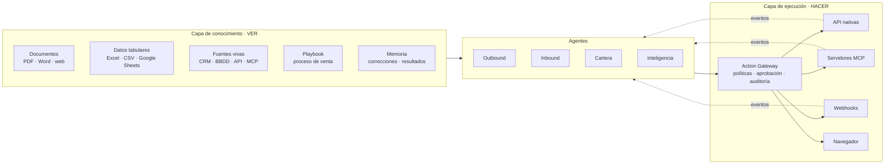
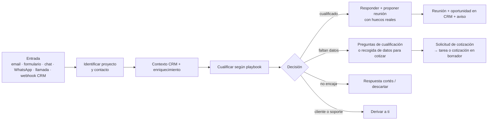
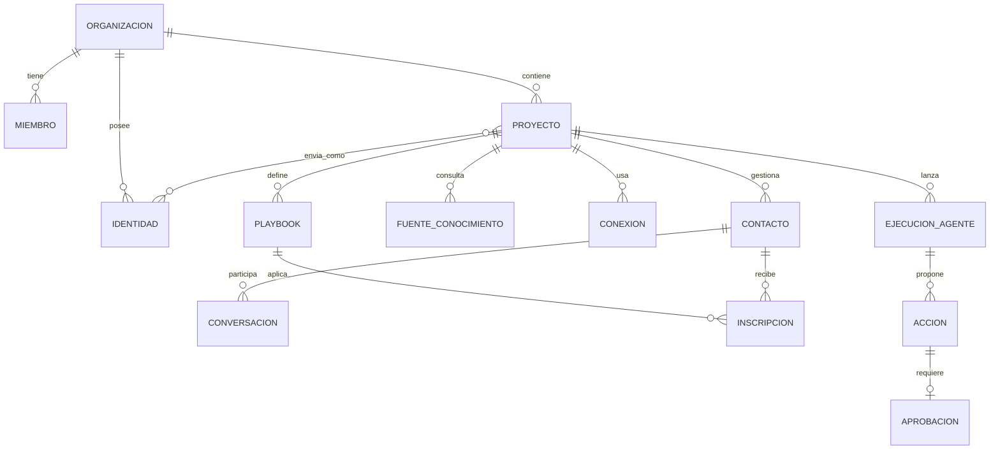
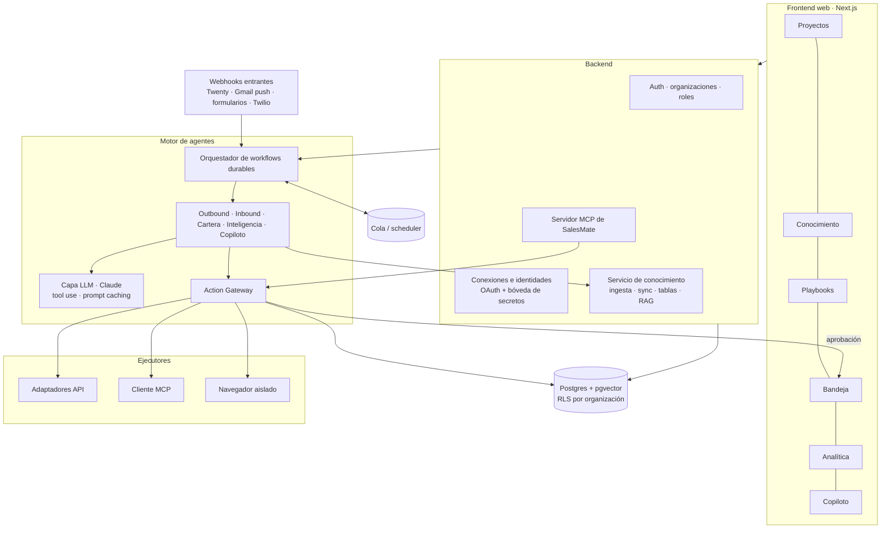

# SalesMate — Plan de producto y técnico

> Plataforma web multiproyecto con agentes de IA que **ven** la información
> comercial de cada proyecto (CRM, documentos, tarifas, bases de datos, hojas
> de cálculo…) y **ejecutan** procesos de venta outbound e inbound sobre las
> herramientas que ese proyecto ya usa (CRM, correo, calendario, teléfono,
> WhatsApp…), vía API, MCP o navegador.
>
> Inspiración: [Alta](https://www.altahq.com/) (agentes *Katie* outbound,
> *Alex* inbound y *Luna* inteligencia/crecimiento).
>
> Pensada primero para uso propio con proyectos reales y, desde el diseño,
> preparada para venderse como SaaS a terceros.

---

## Índice

1. [Objetivo y principios](#1-objetivo-y-principios)
2. [Proyectos piloto](#2-proyectos-piloto)
3. [Qué tomamos de Alta y qué adaptamos](#3-qué-tomamos-de-alta-y-qué-adaptamos)
4. [El núcleo: ver y hacer](#4-el-núcleo-ver-y-hacer)
5. [Capa de conocimiento comercial (ver)](#5-capa-de-conocimiento-comercial-ver)
6. [Playbook: el proceso de venta como dato](#6-playbook-el-proceso-de-venta-como-dato)
7. [Capa de ejecución (hacer)](#7-capa-de-ejecución-hacer)
8. [Los agentes](#8-los-agentes)
9. [Autonomía, aprobaciones y guardarraíles](#9-autonomía-aprobaciones-y-guardarraíles)
10. [Modelo de dominio y multi-tenant](#10-modelo-de-dominio-y-multi-tenant)
11. [Módulos de la aplicación](#11-módulos-de-la-aplicación)
12. [Integraciones](#12-integraciones)
13. [Arquitectura técnica](#13-arquitectura-técnica)
14. [Modelo de datos inicial](#14-modelo-de-datos-inicial)
15. [Legal, cumplimiento y entregabilidad](#15-legal-cumplimiento-y-entregabilidad)
16. [Roadmap por fases](#16-roadmap-por-fases)
17. [Métricas](#17-métricas)
18. [Costes orientativos](#18-costes-orientativos)
19. [Riesgos y mitigaciones](#19-riesgos-y-mitigaciones)
20. [Decisiones abiertas](#20-decisiones-abiertas)
21. [Próximos pasos inmediatos](#21-próximos-pasos-inmediatos)

---

## 1. Objetivo y principios

**Objetivo:** que una persona o un equipo pequeño pueda vender en paralelo en
varios proyectos delegando en agentes de IA el trabajo repetitivo de
prospección, seguimiento, cualificación, cotización y agendado, sin perder el
control sobre lo que sale en su nombre.

**Principios de diseño**

| Principio | Qué implica |
|---|---|
| **Ver y hacer, separados** | Un agente primero se informa (conocimiento) y después actúa (ejecución). Son capas distintas, con permisos distintos y auditables por separado. |
| **El proyecto aísla** | Cada proyecto tiene su oferta, su proceso de venta, sus fuentes de datos, sus conexiones, sus contactos y sus límites. Un agente nunca mezcla datos ni identidades entre proyectos sin una regla explícita. |
| **El usuario es el experto** | El usuario transmite su proceso de venta (documentos, tablas, reglas, ejemplos) y el sistema lo convierte en un *playbook* que los agentes siguen. |
| **Humano en el bucle por defecto** | Todo empieza en "borrador + aprobación". La autonomía se concede por proyecto, por agente y por tipo de acción. |
| **Herramientas existentes como fuente de verdad** | El CRM del proyecto sigue siendo el sistema de registro. SalesMate lee, orquesta y escribe en él; no obliga a migrar. |
| **Cualquier vía de integración** | API nativa, servidores MCP, webhooks, ficheros y, como último recurso, automatización del navegador. |
| **Multi-tenant desde el día 1** | Aunque al principio el único cliente seas tú, el modelo de datos, la seguridad y las integraciones se diseñan para clientes externos. |
| **Todo es auditable** | Cada acción queda registrada con qué datos se usaron, por qué, quién la aprobó y su resultado. |

---

## 2. Proyectos piloto

Los tres proyectos reales sirven de banco de pruebas: cubren B2B y B2C,
venta directa y captación de colaboradores, producto simple y producto regulado.

| | **Swipoo** | **Protectio** | **Actividad como autónomo** |
|---|---|---|---|
| Qué es | Gestoría especializada en trámites de vehículos | Correduría de seguros (en lanzamiento) | Servicios profesionales |
| Estado | Activo | A punto de arrancar | Activo |
| Modelo | B2B | B2B y B2C | B2B |
| Cliente objetivo | Concesionarios (compraventa, VO/VN) | Empresas, particulares y **colaboradores** que aportan pólizas | *Por definir* |
| CRM | *Por confirmar* | **Twenty** (con MCP) | *Por confirmar* |
| Calendario | Google Calendar (posible cuenta compartida) | Google Calendar (posible cuenta compartida) | Google Calendar |
| Canal principal previsto | Outbound (email + llamada + LinkedIn) a concesionarios | Inbound (B2C) + outbound para captar colaboradores y empresas | Outbound selectivo + red de contactos |
| Particularidad | Venta recurrente por volumen de trámites; el decisor suele ser gerencia o jefe de administración | Producto regulado (distribución de seguros), varias aseguradoras por oportunidad, renovaciones anuales | Personal: voz propia muy marcada |

### 2.1 Lo que ya existe en el CRM de Protectio (Twenty)

El modelo de Twenty ya refleja el proceso de la correduría. SalesMate se adapta a
él en vez de imponer el suyo:

| Objeto Twenty | Significado | Uso por los agentes |
|---|---|---|
| `people` / `companies` / `clientes` | Contactos, empresas y clientes | Identificar y enriquecer; tomador de las pólizas |
| `opportunities` | Oportunidad de venta de seguro | Pipeline principal de venta |
| `cotizaciones` | Oferta de una aseguradora dentro de una oportunidad (prima, suma asegurada, franquicia, forma de pago, validez) | Preparar comparativas, perseguir cotizaciones a punto de caducar |
| `polizas` | Póliza emitida (efecto, vencimiento/renovación, tomador, activo, colaborador, póliza anterior) | Renovaciones, venta cruzada, retención |
| `aseguradoras` / `ramos` | Catálogo de compañías y ramos | Conocimiento estructurado de producto |
| `activos` | Bien asegurado (p. ej. vehículo) | Contexto de cotización |
| `captaciones` | Pipeline de captación de colaboradores (etapa, fuente, tipo, % comisión pactada) | Agente outbound de captación de colaboradores |
| `colaboradores` | Colaboradores que aportan pólizas | Seguimiento y activación |
| `tasks` / `notes` / `messages` / `calendar_events` | Actividad | Registro de todo lo que hacen los agentes |

Además, Twenty ofrece **webhooks** por evento de registro (p. ej. "se crea una
oportunidad"), **workflows** propios, y acciones de envío de email y creación de
eventos de calendario desde las cuentas conectadas. Todo ello son puntos de
entrada y de salida para los agentes.

### 2.2 Sinergia entre proyectos

Un concesionario cliente de Swipoo es un candidato natural a **colaborador** de
Protectio: vende vehículos que necesitan seguro. El sistema debe:
- Detectar que una cuenta existe en ambos proyectos.
- Permitir **jugadas cruzadas explícitas** ("presentar Protectio a clientes de Swipoo satisfechos") con reglas propias: quién contacta, con qué identidad y con qué base legal.
- Impedir el contacto cruzado accidental (dos proyectos escribiendo a la misma persona la misma semana).

---

## 3. Qué tomamos de Alta y qué adaptamos

| Alta | SalesMate | Adaptación |
|---|---|---|
| **Katie**: agente outbound; busca prospectos, detecta señales, outreach multicanal | **Agente Outbound** | Por proyecto y por *playbook* (p. ej. "concesionarios para Swipoo", "colaboradores para Protectio"). |
| **Alex**: agente inbound; cualifica por llamada/chat con contexto CRM, puntúa y enruta | **Agente Inbound** | Formularios, email, WhatsApp, chat y voz; en seguros además recoge datos para cotizar. |
| **Luna**: agente de crecimiento; señales, lookalikes, mejora continua | **Agente de Inteligencia** | Señales del sector (aperturas de concesionarios, stock en portales, vencimientos de pólizas), lookalikes, optimización. |
| — | **Agente de Cartera** (nuevo) | Renovaciones, venta cruzada, reactivación de clientes: clave en seguros y en servicios recurrentes como Swipoo. |
| — | **Copiloto** | Chat transversal: "¿qué tengo hoy?", "prepárame la llamada con X", "¿qué cotizaciones caducan esta semana?". |

Diferencia de fondo: Alta sirve a un equipo comercial de una empresa.
SalesMate sirve a **una persona o equipo con varios negocios** y debe resolver
el aislamiento entre proyectos, la identidad de envío de cada proyecto, la
disponibilidad compartida y una bandeja única de aprobaciones.

---

## 4. El núcleo: ver y hacer



- **Ver**: toda la información que un agente puede consultar para decidir. Solo lectura.
- **Hacer**: todo efecto en el mundo exterior. Siempre pasa por el *Action Gateway*.
- Una misma conexión (p. ej. Twenty) puede aportar a las dos capas: leer oportunidades (ver) y crear tareas (hacer). Los **permisos se conceden por separado**: puedes dejar que un agente lea tu CRM sin dejarle escribir.

---

## 5. Capa de conocimiento comercial (ver)

El usuario tiene que poder transmitir su conocimiento de venta de cualquier
forma. Cada tipo de información se trata de manera distinta, porque **no todo
debe ir a una búsqueda semántica**: un precio se consulta, no se "recuerda".

### 5.1 Tipos de fuente

| Tipo | Ejemplos | Cómo se ingiere | Cómo la usa el agente |
|---|---|---|---|
| **Documentos estáticos** | Presentaciones, propuestas antiguas, FAQs, condicionados, guiones, web del proyecto | Subida o URL → extracción de texto → fragmentos + embeddings | Búsqueda semántica (RAG) con cita de la fuente |
| **Datos tabulares** | Tarifas de Swipoo por trámite, comisiones por aseguradora, listado de concesionarios, matrices de precios | Subida de Excel/CSV o conexión a Google Sheets → **tabla consultable** con esquema detectado y validado por ti | Herramienta de consulta estructurada ("precio de transferencia para turismo en Madrid") — nunca inventa cifras |
| **Fuentes vivas** | CRM (Twenty, HubSpot…), base de datos de precios (Postgres/MySQL), API interna, servidor MCP de terceros | Conexión con credenciales; descubrimiento del esquema; elección de qué objetos/tablas se exponen | Consulta en tiempo real como herramienta, con caché corta y límites |
| **Playbook** | Etapas, criterios de cualificación, objeciones, plantillas, reglas | Editor guiado o generado desde tus documentos y validado por ti (ver §6) | Instrucciones de proceso que el agente sigue paso a paso |
| **Ejemplos** | Emails buenos, llamadas transcritas, propuestas ganadas | Subida o captura desde el buzón/CRM | Ejemplos para imitar voz y estructura |
| **Memoria** | Tus correcciones, motivos de rechazo, qué obtuvo respuesta | Automática | Mejora continua del proyecto |

### 5.2 Modos de sincronización

Cada fuente declara cómo se mantiene al día:

| Modo | Cuándo usarlo | Ejemplo |
|---|---|---|
| **Instantánea** (subida única) | Información que cambia poco | PDF de condiciones generales |
| **Sincronización programada** | Datos que cambian a diario/semanal | Google Sheet de tarifas cada noche |
| **Consulta en vivo** | Datos que deben estar al segundo | Estado de una oportunidad en Twenty, disponibilidad del calendario |
| **Push por evento** | Cambios que deben despertar a un agente | Webhook de Twenty "oportunidad creada", nuevo email, formulario enviado |

### 5.3 Catálogo de conocimiento del proyecto

Cada proyecto tiene un **catálogo** visible que responde: qué sabe el agente,
de dónde, cuándo se actualizó y quién lo validó. Incluye:
- Vista previa de cada fuente y de su esquema.
- Campo "fiabilidad": *fuente de verdad* (p. ej. tarifas) vs. *orientativa* (p. ej. propuestas antiguas).
- Detección de contradicciones (dos fuentes con precios distintos) y aviso.
- Prueba en vivo: "pregúntale al agente" para comprobar que responde bien antes de activarlo.

### 5.4 Reglas de uso del conocimiento

- Precios, plazos, coberturas y condiciones **solo** salen de fuentes marcadas como fuente de verdad; si no hay dato, el agente lo dice y te pregunta.
- Toda afirmación factual en un mensaje guarda internamente su cita (fuente + fragmento/fila), visible en la aprobación.
- Las fuentes vivas exponen solo lo que eliges (p. ej. de Twenty: oportunidades y cotizaciones sí; IBAN de colaboradores no).

---

## 6. Playbook: el proceso de venta como dato

El *playbook* es la forma en que transmites **cómo vendes**. Es la pieza que
convierte una IA genérica en un comercial de tu proyecto.

### 6.1 Contenido

```yaml
playbook: "Captación de concesionarios — Swipoo"
objetivo: "Reunión de 20 min con gerente o jefe de administración"
segmento:
  incluye: [concesionarios VO/VN, compraventas con >30 vehículos en stock]
  excluye: [clientes actuales, concesionarios con contrato en exclusiva]
  geografia: [España]
decisores: [gerente, director financiero, jefe de administración]
dolores:
  - "Retrasos en transferencias que bloquean entregas"
  - "Coste interno de gestionar trámites con personal propio"
propuesta_de_valor: "fuente: kb/presentacion-swipoo.pdf"
precios: "fuente: tabla/tarifas-swipoo"     # nunca se improvisan
cualificacion:
  - volumen_mensual_tramites >= 20
  - usa_gestoria_actual: registrar cuál
etapas:
  - nuevo → contactado → respondió → reunión → propuesta → cliente
cadencia:
  - dia 0: email personalizado
  - dia 2: tarea de llamada (guion adjunto)
  - dia 5: email de seguimiento con caso de éxito
  - dia 10: tarea de LinkedIn
  - dia 15: email de cierre de ciclo
objeciones:
  "Ya tenemos gestoría": "fuente: kb/objeciones.md#gestoria"
  "Es caro": "fuente: kb/objeciones.md#precio"
reglas:
  - nunca ofrecer descuentos sin aprobación
  - no contactar en agosto ni en la última semana del mes (cierre de ventas)
handoff: "si pide precio cerrado o volumen > 200/mes → avisar a Fredi"
```

### 6.2 Cómo se crea
1. **Desde tus documentos**: subes tu presentación, tarifas y un par de emails buenos, y la IA propone un borrador de playbook.
2. **Entrevista guiada**: el sistema te pregunta lo que falta (decisores, objeciones, qué hacer si…).
3. **Edición directa**: formulario + YAML avanzado.
4. **Versionado**: cada cambio crea una versión; se puede comparar el rendimiento entre versiones.

### 6.3 Varios playbooks por proyecto
Protectio, por ejemplo, tendría al menos:
- *Captación de colaboradores* (outbound B2B, objeto `captaciones` de Twenty).
- *Seguros para empresas* (outbound/inbound B2B, oportunidades y cotizaciones).
- *Seguros para particulares* (inbound B2C, con requisitos regulatorios; ver §15.2).
- *Renovaciones y venta cruzada* (agente de cartera sobre `polizas`).

---

## 7. Capa de ejecución (hacer)

### 7.1 Capacidades, no proveedores

Los agentes no llaman a "Twenty" o "Gmail", sino a **capacidades** con un
contrato fijo. Cada conector implementa las que puede:

```
crm.search  crm.get  crm.upsert_contact  crm.upsert_company  crm.upsert_deal
crm.move_stage  crm.create_task  crm.log_activity  crm.custom_object.*   ← p. ej. cotizaciones, captaciones
email.list_threads  email.get_thread  email.create_draft  email.send  email.watch
calendar.free_busy  calendar.book  calendar.cancel  calendar.watch
phone.call  phone.sms  messaging.send  messaging.watch
data.search_companies  data.search_people  data.enrich  data.verify_email
table.query            ← tablas de conocimiento (tarifas…)
kb.search  web.research  browser.run_task
```

### 7.2 Vías de ejecución

| Vía | Cuándo | Ejemplos |
|---|---|---|
| **API nativa** | Siempre que exista y sea estable. Máximo control y fiabilidad. | Gmail API, Google Calendar API, API REST/GraphQL de Twenty |
| **Cliente MCP** | La herramienta publica un servidor MCP: integración rápida, también para herramientas que el usuario aporte. | MCP de Twenty, MCP de herramientas de datos, MCP propios del cliente |
| **Webhooks** | Recibir eventos y disparar flujos. | Webhooks de Twenty, formularios web, Twilio |
| **Navegador** (último recurso) | Herramientas sin API: portales de aseguradoras para cotizar, portales de tráfico/administración, webs de terceros. | Agente de navegador con sesión aislada, grabación de pasos y aprobación previa |
| **Ficheros** | Intercambio por lotes. | Exportar una lista a Excel, importar un CSV de leads |

Reglas:
- Las herramientas que exponen los servidores MCP externos **no** se dan al agente tal cual: se mapean a capacidades y pasan por el gateway, para que una herramienta de escritura (p. ej. "borrar registros") nunca quede al alcance del agente sin control.
- La automatización de navegador se limita a tareas concretas definidas por ti, con credenciales en una bóveda y revisión de cada ejecución al principio.

### 7.3 SalesMate como servidor MCP

SalesMate también **expone** su propio servidor MCP, para que agentes externos
(Claude, otros asistentes, los de tus clientes) puedan consultar el pipeline,
crear tareas o pedir un borrador respetando las mismas políticas y aprobaciones.
De cara al SaaS es un argumento de venta: "tu IA puede vender con SalesMate".

### 7.4 Action Gateway

Toda acción con efecto externo sigue este ciclo:

```
propuesta del agente (con citas de las fuentes usadas)
  → validación de esquema
  → políticas: límites, horario, exclusiones, deduplicación entre proyectos, contenido, normativa del canal
  → ¿el nivel de autonomía permite ejecutar? ── no ──→ cola de aprobación → aprobada / editada / rechazada
  → ejecución idempotente vía API · MCP · navegador
  → registro en auditoría + actividad en el CRM del proyecto
  → evento de resultado (enviado, rebotado, respondido, reunión creada…)
```

Requisitos: idempotencia (nunca enviar dos veces), reintentos con espera
creciente, registro inmutable y "deshacer" donde sea posible (borrar borrador,
cancelar reunión, revertir cambio de CRM).

---

## 8. Los agentes

Todos comparten la misma infraestructura: reciben un **objetivo**, cargan el
**contexto del proyecto** (playbook, conocimiento, reglas), usan
**herramientas** de la capa de ver, y proponen **acciones** a la capa de hacer.

### 8.1 Agente Outbound

```mermaid
flowchart LR
    A[Playbook + segmento] --> B[Construir lista<br/>CRM · datos · CSV · fuentes sectoriales]
    B --> C[Deduplicar<br/>CRM · otros proyectos · exclusiones]
    C --> D[Enriquecer y verificar]
    D --> E[Puntuar encaje + señales]
    E --> F[Investigar cuenta y persona]
    F --> G[Redactar con la voz del proyecto<br/>citando las fuentes]
    G --> H{Gateway}
    H -->|aprobado| I[Enviar · crear tarea de llamada/LinkedIn]
    I --> J[Cadencia]
    J --> K{¿Respuesta?}
    K -->|sí| L[Clasificar → Agente Inbound]
    K -->|no| J
```



Ejemplos por proyecto:
- **Swipoo → concesionarios**: listas a partir de directorios sectoriales, Google Maps/Places y portales de vehículos (concesionarios con stock publicado); señales como apertura de nuevas sedes, aumento de stock o anuncios de empleo de personal administrativo; cadencia de email + llamada + LinkedIn.
- **Protectio → colaboradores**: concesionarios, talleres, gestorías y asesorías que pueden derivar pólizas; registra en `captaciones` y, al ganarse, da de alta en `colaboradores`.
- **Autónomo**: outbound selectivo y personal, pocas cuentas muy investigadas.

### 8.2 Agente Inbound



En **Protectio B2C** el agente inbound recoge los datos necesarios para cotizar
(tipo de seguro, activo, coberturas deseadas), crea la oportunidad y las
solicitudes de cotización, y deja la recomendación y la contratación en manos de
una persona habilitada (ver §15.2).

### 8.3 Agente de Cartera
- **Renovaciones**: vigila `fechaVencimiento` de las pólizas; con N días de antelación prepara la revisión, pide nuevas cotizaciones y propone el contacto con el cliente.
- **Cotizaciones a punto de caducar** (`validaHasta`): recordatorio al cliente o a ti.
- **Venta cruzada**: cliente con seguro de auto sin hogar; concesionario de Swipoo sin acuerdo con Protectio.
- **Reactivación**: clientes de Swipoo con caída de volumen de trámites.

### 8.4 Agente de Inteligencia
- Investigación de cuentas bajo demanda.
- Vigilancia de señales y generación de "cuentas calientes".
- Lookalikes a partir de tus mejores clientes por proyecto.
- Análisis de resultados por playbook, versión, asunto y canal → propone cambios que tú apruebas.

### 8.5 Copiloto
Interfaz conversacional sobre todo lo anterior: resumen diario multiproyecto,
preparación de llamadas, búsqueda en conversaciones y "hazlo tú" (lanzar un
agente sobre una tarea concreta).

---

## 9. Autonomía, aprobaciones y guardarraíles

### 9.1 Niveles de autonomía (por proyecto × agente × tipo de acción)

| Nivel | Nombre | Comportamiento |
|---|---|---|
| 0 | **Sugerir** | Solo propone ideas o tareas; tú ejecutas. |
| 1 | **Borrador** | Prepara la acción completa; nada sale sin aprobación. *(por defecto)* |
| 2 | **Autónomo con límites** | Ejecuta acciones de bajo riesgo dentro de reglas y pide aprobación para el resto. |
| 3 | **Autónomo** | Ejecuta todo dentro de los límites; revisión a posteriori. |

Acciones que **nunca** son automáticas por defecto: ofrecer descuentos o
precios fuera de tarifa, recomendar un seguro concreto a un particular, enviar
documentación contractual y borrar datos del CRM.

### 9.2 Guardarraíles del Action Gateway
- Límites diarios por buzón, número y proyecto; ventanas horarias por zona horaria del destinatario.
- Listas de exclusión globales y por proyecto (bajas, clientes, competidores, Lista Robinson).
- Deduplicación y "enfriamiento" entre proyectos.
- Detección de mensajes que obligan a parar ("baja", "no me escribas", quejas, temas legales).
- Validación de contenido: ninguna cifra sin cita de una fuente de verdad, sin promesas no autorizadas y sin datos sensibles.
- Reglas regulatorias por canal y tipo de destinatario (§15).
- Presupuesto de IA y de créditos de datos por proyecto.
- Botón de parada global y por proyecto.

### 9.3 Aprendizaje
Cada edición o rechazo se guarda con su motivo y alimenta los ejemplos del
proyecto y el conjunto de evaluación de los agentes.

---

## 10. Modelo de dominio y multi-tenant



- **Organización (tenant)**: el cliente de SalesMate. Tú serías la primera organización; un cliente externo, otra. Aislamiento total de datos entre organizaciones.
- **Miembros y roles**: propietario, administrador, comercial (solo sus proyectos) y lector. Permite que socios de Swipoo o Protectio aprueben acciones de su proyecto.
- **Proyecto**: empresa, marca o actividad dentro de la organización.
- **Identidad**: buzón, número de teléfono, cuenta de WhatsApp o **calendario**. Pertenece a la organización y se asigna a uno o varios proyectos. Así se resuelve que una misma cuenta de Google sirva a varios proyectos.

### 10.1 Calendario compartido entre proyectos

Eres una sola persona con una sola agenda, aunque vendas en tres proyectos:

- **Disponibilidad global**: al buscar huecos, el agente consulta *todos* los calendarios conectados de la persona (free/busy), sea cual sea el proyecto.
- **Tipos de reunión por proyecto**: duración, márgenes, horario permitido, enlace de videollamada, plantilla de invitación y calendario de destino.
- **Etiquetado**: cada evento creado lleva el proyecto en sus metadatos (y opcionalmente un color o un calendario secundario por proyecto dentro de la misma cuenta) para poder filtrarlo y medirlo.
- **Prioridades**: reservar franjas por proyecto (p. ej. mañanas para Swipoo) si quieres.

### 10.2 Identidad de envío por proyecto
Cada proyecto define desde qué buzón, firma, dominio y número sale cada canal.
El gateway rechaza cualquier acción que use una identidad no asignada al proyecto.

---

## 11. Módulos de la aplicación

1. **Proyectos**: alta guiada (web → la IA propone oferta, segmentos y voz), plantillas por tipo de negocio y parada de emergencia.
2. **Conocimiento**: catálogo de fuentes (documentos, tablas, fuentes vivas), sincronización, validación y "pregúntale al agente".
3. **Playbooks**: editor, versiones, simulador ("¿qué haría el agente con este lead?").
4. **Conexiones e identidades**: catálogo de conectores (API/MCP/webhook/navegador), permisos de lectura y escritura por separado, salud de las conexiones, mapeo de campos y etapas.
5. **Bandeja unificada**: aprobaciones de todos los proyectos (también desde el móvil), conversaciones clasificadas, tareas manuales (llamadas, LinkedIn).
6. **Contactos y listas**: espejo del CRM más enriquecimiento, segmentos y puntuaciones.
7. **Agentes**: configuración, autonomía, límites e historial de ejecuciones con su traza.
8. **Analítica**: por proyecto, playbook y agente, incluido el coste por reunión.
9. **Copiloto**.
10. **Administración SaaS**: organización, miembros, roles, facturación, uso y auditoría.

---

## 12. Integraciones

| Categoría | Prioridad 1 (pilotos) | Después | Notas |
|---|---|---|---|
| **CRM** | **Twenty** (API + MCP + webhooks) | HubSpot, Pipedrive, Salesforce, Zoho; Notion/Airtable como CRM ligero | Mapeo de objetos personalizados (cotizaciones, pólizas, captaciones). |
| **Email** | Gmail / Google Workspace | Microsoft 365, IMAP/SMTP | Envío desde el buzón real. Alternativa inicial: usar las cuentas ya conectadas en Twenty. |
| **Calendario** | Google Calendar (free/busy de varias cuentas) | Outlook, Cal.com, Calendly | Disponibilidad global, ver §10.1. |
| **Conocimiento tabular** | Excel/CSV, Google Sheets | Postgres/MySQL externos, Airtable, API REST genérica | Tarifas y comisiones como tablas consultables. |
| **Documentos** | Subida de ficheros, URLs | Google Drive, Notion | Indexado para RAG. |
| **Formularios** | Webhook genérico + snippet propio | Typeform, Tally, WordPress | Entrada principal de inbound B2C. |
| **Datos/enriquecimiento** | Google Places, Apollo o Clay | Lusha, Hunter, Crunchbase, directorios sectoriales | Concesionarios en España: Places y portales de vehículos dan mejor cobertura que las bases B2B generalistas. |
| **Verificación de email** | NeverBounce / ZeroBounce | — | Obligatoria antes de outbound. |
| **WhatsApp** | — | WhatsApp Business Cloud API | Muy relevante para concesionarios y B2C; requiere opt-in y plantillas. |
| **Voz** | Click-to-call + grabación + resumen | Agente de voz (Twilio + Vapi/Retell/ElevenLabs) | Voz IA solo inbound o con consentimiento. |
| **LinkedIn** | Tareas manuales asistidas | Proveedor de automatización (riesgo) | Sin API de mensajería; riesgo de bloqueo de la cuenta. |
| **Navegador** | — | Portales de aseguradoras, portales de terceros sin API | Fase avanzada, con aprobación. |
| **Notificaciones** | Email + push web | Slack, Telegram, WhatsApp interno | Leads calientes y aprobaciones. |
| **ERP/facturación** | — | Founderp, Holded | Cliente ganado → alta y factura en borrador. |
| **MCP genérico** | Conectar cualquier servidor MCP que aporte el cliente | Marketplace de conectores | Clave para el SaaS: el cliente trae sus herramientas. |

---

## 13. Arquitectura técnica

### 13.1 Vista general



### 13.2 Stack recomendado

| Capa | Elección | Por qué / alternativas |
|---|---|---|
| Lenguaje | **TypeScript** en todo el stack | Un único lenguaje para UI, API y agentes. |
| Frontend + API | **Next.js** (App Router) + Tailwind + shadcn/ui | Alternativa: React Router. |
| Base de datos | **Postgres** (Supabase o Neon) + **pgvector** | Relacional, vectores y tablas de conocimiento en el mismo sitio. **RLS por organización y proyecto.** |
| ORM | Drizzle | Alternativa: Prisma. |
| Auth | Supabase Auth o Clerk (organizaciones y roles) | Clerk trae organizaciones de serie. |
| Workflows durables | **Inngest** o **Trigger.dev** | Esperas de días, reintentos, reanudación tras aprobación. Alternativa: Temporal. |
| LLM | **Claude** (API de Anthropic): *tool use*, salidas estructuradas, *prompt caching* | Modelo grande para investigación y redacción; modelo rápido para clasificación y triaje. Proveedor abstraído. |
| MCP | SDK oficial de MCP (TypeScript) como cliente y servidor | Conectar MCP de terceros (Twenty) y exponer el de SalesMate. |
| Integraciones OAuth | Adaptadores propios + **Nango** o **Composio** | Ahorra meses en OAuth, refresco de tokens y sincronización. |
| Ingesta de documentos | Extracción PDF/Office + fragmentado + embeddings | Excel/CSV → tablas Postgres por fuente con esquema validado. |
| Navegador | Playwright en un entorno aislado (o servicio gestionado tipo Browserbase) | Fase avanzada. |
| Secretos | Cifrado por columna (pgsodium/KMS) | Tokens y credenciales nunca en claro. |
| Ficheros | Supabase Storage / S3 | Documentos y grabaciones. |
| Hosting | **Vercel** (web) + workers del proveedor de workflows | Alternativa: Railway/Fly.io. Región UE. |
| Facturación SaaS | Stripe (suscripción + uso medido) | Fase SaaS. |
| Observabilidad | Sentry + Langfuse (trazas y evaluaciones de LLM) | Imprescindible para depurar agentes. |

### 13.3 Contexto de los agentes
- **Proyecto** (estable, cacheado): playbook, voz, reglas y ejemplos aprobados.
- **Contacto** (dinámico): ficha, historial, actividades del CRM e investigación previa.
- **Conocimiento** (bajo demanda): búsqueda en documentos y consultas a tablas y fuentes vivas como herramientas.
- **Memoria**: correcciones y resultados.

### 13.4 Calidad
- Conjunto de casos de prueba por playbook (leads reales anonimizados, emails entrantes, prospectos).
- Evaluación automática (reglas + LLM como juez) antes de cambiar prompts, modelos o playbooks.
- Métrica principal de calidad: **% de acciones aprobadas sin edición**.

---

## 14. Modelo de datos inicial

Todas las tablas llevan `org_id` y, salvo las globales, `project_id`, con
*row-level security*.

```
-- Tenancy
organizations        (id, name, plan, settings jsonb)
members              (id, org_id, user_id, role)
users                (id, email, name, timezone)

-- Proyectos
projects             (id, org_id, name, type, website, languages, timezone, status, settings jsonb)
identities           (id, org_id, kind [email|calendar|phone|whatsapp], provider, address, connection_id)
project_identities   (project_id, identity_id, channel, is_default)
meeting_types        (id, project_id, name, duration, buffers, hours jsonb, calendar_identity_id, template)

-- Conocimiento (ver)
knowledge_sources    (id, project_id, kind [document|table|live|examples], name, connection_id,
                      sync_mode [snapshot|scheduled|live|push], schedule, reliability [truth|reference],
                      exposed_objects jsonb, last_synced_at, validated_by, status)
kb_documents         (id, source_id, title, uri, checksum)
kb_chunks            (id, document_id, content, embedding vector, metadata jsonb)
knowledge_tables     (id, source_id, name, schema jsonb, row_count)        -- p. ej. tarifas
knowledge_rows       (id, table_id, data jsonb)                            -- o tabla física por fuente

-- Proceso
playbooks            (id, project_id, name, status, current_version)
playbook_versions    (id, playbook_id, version, spec jsonb, created_by, created_at)

-- Conexiones (hacer y ver)
connections          (id, org_id, provider, transport [api|mcp|webhook|browser|file],
                      credentials_encrypted, read_scopes text[], write_scopes text[], status, last_error)
project_connections  (project_id, connection_id, capabilities text[], field_mappings jsonb)

-- CRM espejo
companies            (id, project_id, crm_external_id, domain, name, data jsonb)
contacts             (id, project_id, company_id, crm_external_id, email, phone, linkedin_url, data jsonb,
                      fit_score, intent_score, status, legal_basis, data_origin, do_not_contact bool)
suppressions         (id, org_id, project_id null, type [email|domain|phone], value, reason)
cross_project_links  (id, org_id, contact_key, project_ids uuid[])

-- Conversaciones
conversations        (id, project_id, contact_id, channel, external_thread_id, status, classification)
messages             (id, conversation_id, direction, channel, body, sent_at, metadata jsonb)

-- Ejecución
enrollments          (id, playbook_version_id, contact_id, current_step, status, next_run_at)
agent_configs        (id, project_id, agent_type, autonomy jsonb, limits jsonb)
agent_runs           (id, agent_config_id, trigger, goal, status, trace_id, cost_usd, started_at, ended_at)
actions              (id, run_id, project_id, type, capability, transport, payload jsonb, citations jsonb,
                      status, idempotency_key, executed_at, result jsonb)
approvals            (id, action_id, decision, edited_payload jsonb, reason, decided_by, decided_at)
audit_log            (id, org_id, project_id, actor [agent|user|system|mcp_client], event, data jsonb, created_at)

-- Resultado
meetings             (id, project_id, contact_id, meeting_type_id, calendar_event_id, starts_at, brief)
opportunities_cache  (id, project_id, crm_external_id, stage, amount, close_date)
```

---

## 15. Legal, cumplimiento y entregabilidad

> ⚠️ Orientativo, no es asesoramiento jurídico. Valida el planteamiento con un
> abogado de protección de datos y, para Protectio, con el responsable de
> cumplimiento de la correduría, antes de activar agentes que contacten con
> terceros.

### 15.1 Marco general (España/UE)
- **RGPD / LOPDGDD**: base jurídica por contacto (en B2B, habitualmente interés legítimo documentado), deber de informar en la primera comunicación cuando los datos no se obtienen del interesado (art. 14), derechos de los interesados, registro de actividades, contratos de encargado con proveedores y transferencias internacionales.
- **LSSI-CE (art. 21)**: restringe las comunicaciones comerciales electrónicas no solicitadas sin consentimiento o relación previa. Su aplicación al email B2B en frío es delicada en España: hace falta una política explícita por proyecto, que el sistema debe aplicar.
- **Llamadas comerciales (Ley 11/2022 General de Telecomunicaciones)**: las llamadas comerciales no solicitadas a personas físicas requieren consentimiento previo u otra base legitimadora; consultar la **Lista Robinson**.
- **Ley de IA europea (AI Act, art. 50)**: obligación de informar a las personas de que interactúan con una IA en chat y voz.
- **WhatsApp**: opt-in obligatorio y plantillas aprobadas para iniciar conversaciones.
- **LinkedIn**: sus condiciones prohíben la automatización.

### 15.2 Específico de Protectio (distribución de seguros)
La actividad de correduría está regulada (Real Decreto-ley 3/2020, que
transpone la Directiva de Distribución de Seguros; supervisión de la DGSFP).
Implicaciones para el producto:
- **Información previa** obligatoria al cliente (identidad del mediador, registro, tipo de asesoramiento, remuneración…).
- **Análisis de exigencias y necesidades** antes de proponer un seguro, y **documento de información del producto (IPID)** en no vida.
- La recomendación de producto y la contratación deben quedar en manos de **personal habilitado**: el agente recoge información, prepara comparativas y borradores y agenda; **no recomienda ni cierra por sí mismo** (nivel máximo de autonomía 1 en esas acciones).
- Requisitos de **conservación y trazabilidad** de la información dada al cliente: la auditoría del gateway debe servir como registro.
- **B2C**: comunicaciones comerciales a particulares solo con consentimiento o relación previa; el canal natural es inbound y la cartera propia.

### 15.3 Específico de Swipoo
- Prospección a concesionarios (personas jurídicas). Aun así, los emails nominativos de empleados son datos personales: aplicar interés legítimo documentado, información del art. 14 y baja en un clic.
- Priorizar email corporativo de contacto, teléfono de empresa y canales donde el concesionario ya está expuesto comercialmente.

### 15.4 Requisitos del producto
- Base jurídica y origen del dato en cada contacto.
- Pie legal, información del art. 14 y baja en un clic por proyecto; propagación opcional de bajas entre proyectos.
- Exportación y borrado de datos de un contacto.
- Retención configurable y purgado automático.
- Registro de consentimientos (formularios, WhatsApp, llamadas).
- Para el SaaS: DPA para clientes, lista de subencargados, alojamiento en la UE y registro de actividad por organización.

### 15.5 Entregabilidad de email
- Dominios secundarios para outbound por proyecto, para proteger el dominio principal.
- SPF, DKIM y DMARC comprobados al conectar un buzón.
- Calentamiento progresivo y límites conservadores (orientativo: 30–50 emails/día por buzón al principio).
- Requisitos de Google/Yahoo para remitentes masivos: baja en un clic y tasa de spam < 0,3 %.
- Verificación previa de emails y parada automática si los rebotes superan un umbral.

### 15.6 Requisito SaaS crítico: verificación de Google
Para que clientes externos conecten su Gmail, la app necesita la **verificación
OAuth de Google**. Los permisos de Gmail son *restringidos* y exigen además una
**evaluación de seguridad anual por un tercero** (CASA), con coste y semanas de
plazo. Estrategia:
- **Fase personal**: app OAuth en modo interno/pruebas (suficiente para tus cuentas).
- **Primeros clientes**: valorar Microsoft 365 (requisitos menos costosos), el envío a través de las cuentas ya conectadas en el CRM del cliente (p. ej. Twenty) o un proveedor de integraciones que ya tenga la verificación.
- **SaaS abierto**: presupuestar la verificación y la evaluación CASA.

---

## 16. Roadmap por fases

Estimaciones para 1 desarrollador apoyado por IA; ajústalas a tu disponibilidad.

### Fase 0 — Fundamentos multi-tenant (3–4 semanas)
- Repo, CI, entornos, auth con organizaciones y roles, Postgres con RLS.
- Proyectos, identidades y tipos de reunión (con disponibilidad global de calendario).
- Conexiones: **Twenty** (API + MCP + webhooks), **Google Calendar**, **Gmail**.
- Capa de conocimiento v1: documentos (RAG) y Excel/CSV/Google Sheets como tablas consultables.
- Action Gateway + auditoría + bandeja de aprobaciones (aún sin agentes).
- **Hito:** Swipoo, Protectio y tu actividad de autónomo dados de alta, con sus fuentes y herramientas conectadas, y el copiloto respondiendo preguntas sobre su información.

### Fase 1 — Playbooks + Agente Inbound (4 semanas)
- Editor de playbooks (desde documentos + entrevista guiada) y simulador.
- Inbound por email y formularios: identificar proyecto, cualificar, responder, proponer reunión y registrar en Twenty.
- Protectio: recogida de datos para cotizar → oportunidad + solicitudes de cotización en Twenty.
- Notificaciones y bandeja móvil.
- **Hito:** ningún lead entrante espera más de X minutos a tener una respuesta preparada, en el momento del lanzamiento de Protectio.

### Fase 2 — Agente Outbound, piloto Swipoo (4–6 semanas)
- Construcción de listas de concesionarios (Places, portales, CSV, CRM), deduplicación y exclusiones.
- Verificación, puntuación, investigación y redacción con citas.
- Cadencias email + tareas de llamada/LinkedIn, primer contacto aprobado a mano y seguimientos con autonomía 2.
- Clasificación de respuestas → Inbound.
- Dominios, calentamiento y límites.
- Replicar en Protectio para **captación de colaboradores** (`captaciones`).
- **Hito:** campaña viva de Swipoo generando reuniones cada semana.

### Fase 3 — Cartera y multicanal (4–6 semanas)
- Agente de Cartera: renovaciones de pólizas, cotizaciones que caducan, venta cruzada Swipoo ↔ Protectio.
- WhatsApp Business, chat web por proyecto, click-to-call con grabación y resumen.
- Fuentes vivas adicionales: bases de datos externas y API REST genéricas.
- Cliente MCP genérico (conectar cualquier servidor MCP).

### Fase 4 — Inteligencia y autonomía
- Señales sectoriales, cuentas calientes y lookalikes.
- Optimización de playbooks por versiones (A/B).
- Agente de voz inbound.
- Automatización de navegador para portales sin API (cotizadores de aseguradoras).
- Subida de autonomía donde la tasa de aprobación sin edición lo justifique.

### Fase 5 — SaaS
- Onboarding autoservicio, plantillas de playbooks por sector (gestorías, correduría, servicios profesionales…).
- Facturación (Stripe), planes y límites de uso.
- Servidor MCP público de SalesMate.
- Verificación de Google y evaluación CASA, DPA, página de seguridad.
- Marketplace de conectores.
- **Primeros clientes naturales**: negocios similares a los tuyos (gestorías, corredurías, concesionarios, profesionales independientes) que ya ven el resultado en tus proyectos.

---

## 17. Métricas

| Tipo | Métrica |
|---|---|
| **Negocio** (por proyecto/playbook) | Reuniones por semana, oportunidades, cotizaciones emitidas, pólizas/clientes ganados, ingresos atribuidos, coste por reunión. |
| **Inbound** | Tiempo hasta la primera respuesta, % cualificados, % que agendan o piden cotización. |
| **Outbound** | Respuesta, respuesta positiva, rebotes, bajas, quejas de spam. |
| **Cartera** | % de renovaciones gestionadas a tiempo, retención, venta cruzada. |
| **Calidad del agente** | % aprobado sin edición, motivos de rechazo, afirmaciones sin cita detectadas. |
| **Conocimiento** | Fuentes desactualizadas, contradicciones detectadas, preguntas sin respuesta. |
| **Operación** | Coste de LLM y datos por proyecto, salud de conexiones, minutos al día dedicados a aprobar. |
| **SaaS** | Activación (primer playbook activo), retención, ingresos recurrentes por cliente. |

---

## 18. Costes orientativos

Órdenes de magnitud mensuales para tu uso con tres proyectos; verifica los
precios actuales de cada proveedor.

| Partida | Rango aproximado |
|---|---|
| Hosting web + BD + workflows (planes iniciales) | 0–75 € |
| LLM (Claude), con modelo pequeño para triaje y caching del contexto | 20–200 € |
| Datos/enriquecimiento (Places, Apollo/Clay…) | 50–300 € |
| Verificación de email | 10–50 € |
| Dominios y buzones secundarios para outbound | 10–20 € por buzón |
| WhatsApp / voz (fase 3+) | por uso |
| Observabilidad | 0–50 € |
| Fase SaaS: verificación de Google/CASA, asesoría legal | coste puntual a presupuestar |

---

## 19. Riesgos y mitigaciones

| Riesgo | Mitigación |
|---|---|
| El agente envía algo incorrecto en tu nombre | Borrador por defecto, citas obligatorias, fuentes de verdad, botón de parada, auditoría. |
| Precio o cobertura inventados | Precios solo desde tablas de verdad; validación de cifras en el gateway; acciones de seguros con autonomía máxima 1. |
| Mezcla de datos entre proyectos u organizaciones | `org_id`/`project_id` + RLS, identidades asignadas por proyecto, tests de aislamiento. |
| Incumplimiento normativo (LSSI, llamadas, seguros) | Políticas por canal y tipo de destinatario en el gateway, base jurídica por contacto, revisión legal previa. |
| Herramientas MCP de terceros con permisos excesivos | Solo se exponen capacidades mapeadas; lectura y escritura separadas; nada de herramientas "en bruto" para el agente. |
| Reputación de dominio | Dominios secundarios, calentamiento, límites, verificación, parada por rebotes. |
| Bloqueo de LinkedIn | Tareas manuales por defecto. |
| Dependencia de APIs de terceros | Capa de capacidades + adaptadores + monitor de salud. |
| Bloqueo del SaaS por la verificación de Google | Plan escalonado de §15.6. |
| Coste de IA descontrolado | Presupuesto por proyecto, modelos pequeños para tareas simples, caching. |
| Alcance excesivo | Fases con hitos; no avanzar sin cumplir el anterior. |

---

## 20. Decisiones abiertas

1. **CRM de Swipoo**: ¿también Twenty (en otro workspace) o una herramienta distinta?
2. **Actividad de autónomo**: ¿qué servicio vendes, a quién y con qué CRM, si usas alguno?
3. **Cuentas de Google**: ¿cuántas cuentas y calendarios tienes, y cuáles usa cada proyecto? ¿Buzones de correo separados por proyecto?
4. **Twenty**: ¿uno o varios workspaces? ¿Twenty cloud o autoalojado? ¿Hay ya cuentas de email conectadas dentro de Twenty?
5. **Fuentes de conocimiento de partida**: ¿dónde están hoy las tarifas de Swipoo, las comisiones de Protectio y las presentaciones (Excel, Google Sheets, base de datos, PDF)?
6. **Cotización en Protectio**: ¿cotizáis en portales de aseguradoras, con un comparador/multitarificador o por email? Determina si hace falta automatizar el navegador o hay API.
7. **Volumen**: leads entrantes y prospectos outbound por semana por proyecto.
8. **Equipo**: ¿socios o empleados que deban aprobar o usar la herramienta en Swipoo o Protectio?
9. **Política de outbound** por proyecto (países, tipo de destinatario y canales).
10. **Stack**: ¿te encaja Next.js + Postgres (Supabase o Neon) + Vercel + Inngest?

---

## 21. Próximos pasos inmediatos

1. Resolver las decisiones abiertas de §20.
2. Escribir un primer **playbook en borrador** por proyecto (empezando por Swipoo → concesionarios y Protectio → inbound B2C), usando la plantilla de §6.1.
3. Reunir las fuentes de conocimiento iniciales (tarifas, presentaciones, objeciones, 5–10 emails buenos por proyecto).
4. Validar la política legal de outbound (Swipoo) y de distribución (Protectio).
5. Arrancar la Fase 0: scaffolding (Next.js + TypeScript + Postgres + Drizzle + Inngest), esquema de §14, auth con organizaciones y primer conector: **Twenty**.
