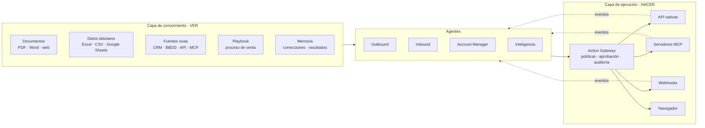
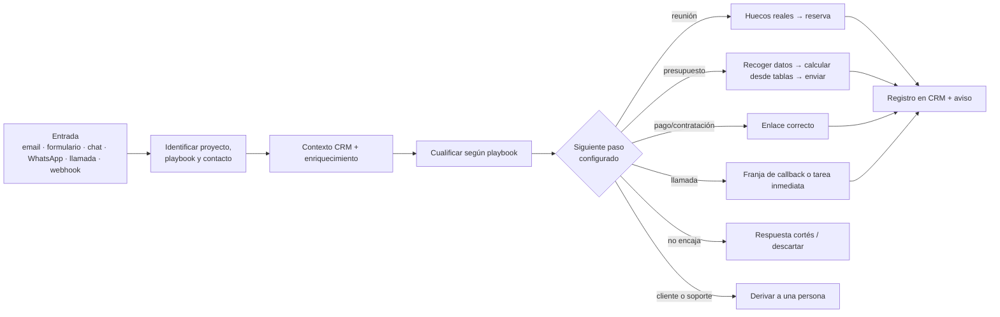
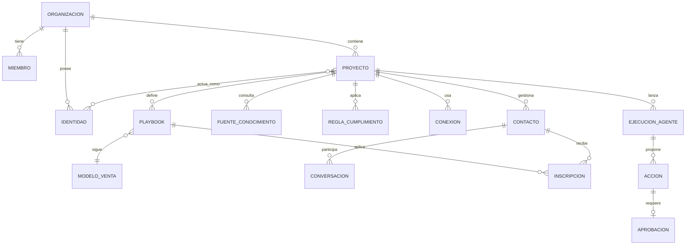

# SalesMate — Plan de producto y técnico

> Plataforma web multiproyecto con agentes de IA que **ven** la información
> comercial de cada proyecto (CRM, documentos, tarifas, bases de datos, hojas
> de cálculo…) y **ejecutan** procesos de venta outbound e inbound sobre las
> herramientas que ese proyecto ya usa (CRM, correo, calendario, teléfono,
> WhatsApp…), vía API, MCP o navegador.
>
> Inspiración: [Alta](https://www.altahq.com/) (agentes *Katie* outbound,
> *Alex* inbound y *Luna* inteligencia/crecimiento).
>
> Agnóstica de sector y de modelo de venta. Pensada primero para uso propio en
> varios proyectos y, desde el diseño, preparada para venderse como SaaS.

---

## Índice

1. [Objetivo y principios](#1-objetivo-y-principios)
2. [Qué tomamos de Alta y qué adaptamos](#2-qué-tomamos-de-alta-y-qué-adaptamos)
3. [El núcleo: ver y hacer](#3-el-núcleo-ver-y-hacer)
4. [Modelos de venta: B2B, B2C y sus variantes](#4-modelos-de-venta-b2b-b2c-y-sus-variantes)
5. [Capa de conocimiento comercial (ver)](#5-capa-de-conocimiento-comercial-ver)
6. [Playbook: el proceso de venta como dato](#6-playbook-el-proceso-de-venta-como-dato)
7. [Capa de ejecución (hacer)](#7-capa-de-ejecución-hacer)
8. [Los agentes](#8-los-agentes)
9. [Autonomía, aprobaciones y guardarraíles](#9-autonomía-aprobaciones-y-guardarraíles)
10. [Modelo de dominio y multi-tenant](#10-modelo-de-dominio-y-multi-tenant)
11. [Módulos de la aplicación](#11-módulos-de-la-aplicación)
12. [Integraciones](#12-integraciones)
13. [Arquitectura técnica](#13-arquitectura-técnica)
14. [Modelo de datos inicial](#14-modelo-de-datos-inicial)
15. [Legal, cumplimiento y entregabilidad](#15-legal-cumplimiento-y-entregabilidad)
16. [Roadmap por fases](#16-roadmap-por-fases)
17. [Métricas](#17-métricas)
18. [Costes orientativos](#18-costes-orientativos)
19. [Riesgos y mitigaciones](#19-riesgos-y-mitigaciones)
20. [Decisiones abiertas](#20-decisiones-abiertas)
21. [Próximos pasos inmediatos](#21-próximos-pasos-inmediatos)

---

## 1. Objetivo y principios

**Objetivo:** que una persona o un equipo pequeño pueda vender en paralelo en
varios proyectos delegando en agentes de IA el trabajo repetitivo de
prospección, seguimiento, cualificación y conversión, sin perder el control
sobre lo que sale en su nombre.

**Principios de diseño**

| Principio | Qué implica |
|---|---|
| **Agnóstico de sector** | Nada del núcleo depende de un sector concreto. Lo específico de cada negocio (productos, reglas, objetos del CRM, normativa sectorial) entra como configuración, conocimiento o reglas del proyecto. |
| **Agnóstico de modelo de venta** | B2B consultivo, B2B transaccional, B2C asistido y B2C autoservicio son variantes configurables del mismo motor, no productos distintos. |
| **Ver y hacer, separados** | Un agente primero se informa (conocimiento) y después actúa (ejecución). Son capas distintas, con permisos distintos y auditables por separado. |
| **El proyecto aísla** | Cada proyecto tiene su oferta, su proceso de venta, sus fuentes de datos, sus conexiones, sus contactos y sus límites. Nada se mezcla entre proyectos sin una regla explícita. |
| **El usuario es el experto** | El usuario transmite su proceso de venta (documentos, tablas, reglas, ejemplos) y el sistema lo convierte en un *playbook* que los agentes siguen. |
| **Humano en el bucle por defecto** | Todo empieza en "borrador + aprobación". La autonomía se concede por proyecto, por agente y por tipo de acción. |
| **Herramientas existentes como fuente de verdad** | El CRM del proyecto sigue siendo el sistema de registro. SalesMate lee, orquesta y escribe en él; no obliga a migrar. |
| **Cualquier vía de integración** | API nativa, servidores MCP, webhooks, ficheros y, como último recurso, automatización del navegador. |
| **Multi-tenant desde el día 1** | Aunque al principio el único cliente seas tú, el modelo de datos, la seguridad y las integraciones se diseñan para clientes externos. |
| **Todo es auditable** | Cada acción queda registrada con qué datos se usaron, por qué, quién la aprobó y su resultado. |

**Proyectos piloto.** Los primeros proyectos reales del usuario (varios
negocios B2B, uno con venta B2B y B2C, y una actividad profesional como
autónomo) sirven para **validar** que la abstracción funciona en modelos de
venta distintos. No condicionan el diseño: cualquier particularidad suya se
resuelve con la configuración genérica descrita aquí.

---

## 2. Qué tomamos de Alta y qué adaptamos

| Alta | SalesMate | Adaptación |
|---|---|---|
| **Katie**: agente outbound; busca prospectos, detecta señales, outreach multicanal | **Agente Outbound** | Por proyecto y por *playbook*; válido para empresas (B2B) y, donde la ley lo permita, personas (B2C). |
| **Alex**: agente inbound; cualifica por llamada/chat con contexto CRM, puntúa y enruta | **Agente Inbound** | El destino no es siempre una reunión: depende del modelo de venta (ver §4). |
| **Luna**: agente de crecimiento; señales, lookalikes, mejora continua | **Agente de Inteligencia** | Señales configurables por proyecto, lookalikes y optimización de playbooks. |
| — | **Agente Account Manager** | Clientes existentes, con enfoque comercial: renovaciones, vencimientos, recompra, venta cruzada, reactivación y referencias. |
| — | **Copiloto** | Chat transversal: "¿qué tengo hoy?", "prepárame la llamada con X", "¿qué está parado?". |

Diferencia de fondo: Alta sirve a un equipo comercial B2B de una empresa.
SalesMate sirve a **una persona o equipo con varios negocios y modelos de
venta distintos**, y debe resolver el aislamiento entre proyectos, la
identidad de cada proyecto, la disponibilidad compartida y una bandeja única de
aprobaciones.

---

## 3. El núcleo: ver y hacer



- **Ver**: toda la información que un agente puede consultar para decidir. Solo lectura.
- **Hacer**: todo efecto en el mundo exterior. Siempre pasa por el *Action Gateway*.
- Una misma conexión (p. ej. el CRM) puede aportar a las dos capas: leer oportunidades (ver) y crear tareas (hacer). Los **permisos se conceden por separado**.

---

## 4. Modelos de venta: B2B, B2C y sus variantes

No todos los procesos de venta terminan en una reunión. Una demo o una
reunión previa son típicas del B2B consultivo; en muchas ventas B2C el cliente
convierte directamente (presupuesto, contratación online, llamada de cierre).
El sistema debe distinguirlo y comportarse en consecuencia.

### 4.1 Dimensiones que definen un modelo de venta

| Dimensión | Valores |
|---|---|
| **Tipo de cliente** | Empresa (B2B) · Persona (B2C) |
| **Ciclo** | Consultivo (varias interacciones, varios decisores) · Transaccional (decisión rápida, un decisor) |
| **Paso de conversión** | Reunión/demo · Propuesta/presupuesto · Enlace de pago o contratación · Llamada de cierre · Visita presencial · Formulario/alta |
| **Volumen** | Pocas cuentas de alto valor · Muchos contactos de bajo valor |
| **Base legal de contacto** | Interés legítimo (B2B) · Consentimiento (B2C, habitualmente) |

### 4.2 Plantillas de modelo de venta (*motions*)

| Plantilla | Ejemplo genérico | Objetivo de conversión | Calendario | Cualificación | Canales típicos |
|---|---|---|---|---|---|
| **B2B consultivo** | Servicios profesionales, software para empresas | Reunión o demo con el decisor → propuesta | **Sí**: reuniones con disponibilidad real | Encaje con ICP, necesidad, decisor, plazo, presupuesto | Email, LinkedIn, llamada |
| **B2B transaccional** | Servicios estandarizados con tarifa pública | Presupuesto o alta directa; reunión solo si la piden | Opcional | Encaje + volumen | Email, llamada, WhatsApp |
| **B2C asistido** | Producto que requiere datos o asesoramiento antes de comprar | Presupuesto personalizado → contratación; llamada de cierre si hace falta | **No** para demos; sí para *franjas de llamada* o *callback* si se quiere | Necesidad, datos mínimos, urgencia | Formulario, WhatsApp, llamada, email |
| **B2C autoservicio** | Producto con precio cerrado y compra online | Enlace de pago o compra online | No | Mínima (intención) | Formulario, chat, WhatsApp, email |

Cada proyecto puede tener **varios playbooks con modelos distintos** (p. ej. una
línea B2B consultiva y otra B2C asistida en el mismo negocio).

### 4.3 Catálogo de "siguientes pasos"

El playbook elige qué acciones de conversión están permitidas y en qué orden.
El agente no "busca una reunión" por defecto: busca el **siguiente paso
configurado**.

| Siguiente paso | Qué hace el agente | Capacidad necesaria |
|---|---|---|
| Agendar reunión o demo | Ofrece huecos reales, reserva y prepara un *brief* | `calendar.*` |
| Agendar llamada (callback) | Ofrece franjas de llamada o crea una tarea de llamada inmediata | `calendar.*` o `crm.create_task` |
| Enviar presupuesto o propuesta | Recoge los datos necesarios, calcula desde las tablas de precios y genera un borrador | `table.query`, `doc.generate` |
| Enviar enlace de pago o contratación | Envía el enlace correcto según el producto | `payment.link` / URL configurada |
| Recoger datos o documentación | Pide la información que falta y la guarda en el CRM | `crm.upsert_*`, `files.store` |
| Derivar a una persona | Crea la tarea y avisa, con todo el contexto | `crm.create_task`, notificaciones |
| Nutrir (*nurturing*) | Lo apunta a una secuencia de contenido hasta que muestre intención | `sequence.enroll` |

### 4.4 Cómo cambia el comportamiento según el modelo

| Aspecto | B2B | B2C |
|---|---|---|
| Unidad | Cuenta (empresa) con varias personas | Persona |
| Investigación previa | Profunda: empresa, cargo, señales | Ligera o nula; prima la velocidad de respuesta |
| Tono y longitud | Profesional y personalizado | Cercano, breve y claro |
| Velocidad de respuesta | Importante | Crítica (minutos) |
| Horario | Laboral del destinatario | Ampliado, según las reglas del proyecto |
| Outbound en frío | Posible con interés legítimo y sus límites | Muy restringido: normalmente solo con consentimiento o relación previa |
| Cierre | Humano, tras reunión y propuesta | Puede completarse sin reunión |

---

## 5. Capa de conocimiento comercial (ver)

El usuario tiene que poder transmitir su conocimiento de venta de cualquier
forma. Cada tipo de información se trata de manera distinta, porque **no todo
debe ir a una búsqueda semántica**: un precio se consulta, no se "recuerda".

### 5.1 Tipos de fuente

| Tipo | Ejemplos | Cómo se ingiere | Cómo la usa el agente |
|---|---|---|---|
| **Documentos estáticos** | Presentaciones, propuestas antiguas, FAQs, condiciones, guiones, web | Subida o URL → extracción → fragmentos + embeddings | Búsqueda semántica (RAG) con cita de la fuente |
| **Datos tabulares** | Tarifas, catálogos, matrices de precios, listados de cuentas | Excel/CSV o Google Sheets → **tabla consultable** con esquema validado por el usuario | Consulta estructurada; nunca inventa cifras |
| **Fuentes vivas** | CRM, base de datos externa, API interna, servidor MCP de terceros | Conexión con credenciales; descubrimiento del esquema; selección de qué se expone | Consulta en tiempo real como herramienta, con caché corta y límites |
| **Playbook** | Modelo de venta, etapas, cualificación, objeciones, plantillas, reglas | Editor guiado o generado desde documentos y validado (§6) | Proceso que el agente sigue paso a paso |
| **Ejemplos** | Emails buenos, llamadas transcritas, propuestas ganadas | Subida o captura desde el buzón/CRM | Para imitar voz y estructura |
| **Memoria** | Correcciones, motivos de rechazo, qué funcionó | Automática | Mejora continua por proyecto |

### 5.2 Modos de sincronización

| Modo | Cuándo | Ejemplo |
|---|---|---|
| **Instantánea** | Información que cambia poco | PDF de condiciones |
| **Programada** | Datos que cambian a diario o semanal | Hoja de tarifas cada noche |
| **Consulta en vivo** | Datos que deben estar al segundo | Estado de una oportunidad, disponibilidad del calendario |
| **Push por evento** | Cambios que deben despertar a un agente | Webhook del CRM, nuevo email, formulario enviado |

### 5.3 Catálogo de conocimiento del proyecto
- Qué sabe el agente, de dónde, cuándo se actualizó y quién lo validó.
- Fiabilidad de cada fuente: *fuente de verdad* (p. ej. tarifas) u *orientativa* (p. ej. propuestas antiguas).
- Detección de contradicciones entre fuentes.
- "Pregúntale al agente" para probar antes de activar.

### 5.4 Reglas de uso
- Precios, plazos, condiciones y compromisos **solo** salen de fuentes marcadas como fuente de verdad; si no hay dato, el agente lo dice y pregunta.
- Toda afirmación factual guarda su cita (fuente + fragmento o fila), visible en la aprobación.
- De las fuentes vivas solo se expone lo que el usuario elige (objetos, campos y operaciones).

---

## 6. Playbook: el proceso de venta como dato

El *playbook* es la forma en que el usuario transmite **cómo vende**. Es lo que
convierte una IA genérica en un comercial de ese proyecto.

### 6.1 Contenido (ejemplos genéricos)

**B2B consultivo**

```yaml
playbook: "Servicio profesional para pymes"
modelo: b2b_consultivo
objetivo_conversion: reunion            # → usa calendario
siguientes_pasos_permitidos: [reunion, enviar_propuesta, derivar_humano]
segmento:
  incluye: [empresas de 10-200 empleados, sector X]
  excluye: [clientes actuales, competidores]
  geografia: [España]
decisores: [gerente, director de operaciones]
dolores: ["fuente: kb/dolores.md"]
propuesta_de_valor: "fuente: kb/presentacion.pdf"
precios: "fuente: tabla/tarifas"         # nunca se improvisan
cualificacion: [necesidad, decisor, plazo, volumen]
etapas: [nuevo, contactado, respondio, reunion, propuesta, ganado, perdido]
cadencia:
  - dia 0: email personalizado
  - dia 2: tarea de llamada
  - dia 5: email con caso de éxito
  - dia 10: tarea de LinkedIn
  - dia 15: email de cierre de ciclo
objeciones: "fuente: kb/objeciones.md"
reglas:
  - nunca ofrecer descuentos sin aprobación
handoff: "si pide precio cerrado o volumen alto → avisar al responsable"
```

**B2C asistido**

```yaml
playbook: "Producto para particulares con presupuesto"
modelo: b2c_asistido
objetivo_conversion: presupuesto         # sin reunión
siguientes_pasos_permitidos: [recoger_datos, enviar_presupuesto, llamada_callback, enlace_contratacion, derivar_humano]
entradas: [formulario_web, whatsapp, email]
datos_necesarios: "fuente: tabla/campos-presupuesto"
precios: "fuente: tabla/tarifas"
tiempo_maximo_respuesta: 5m
seguimiento:
  - +1 h: recordatorio si el presupuesto no se ha abierto
  - +1 día: llamada (tarea) si no hay respuesta
  - +3 días: último recordatorio
reglas:
  - solo contactar a quien lo ha solicitado o ha dado consentimiento
  - acciones reservadas a personas: ver reglas de cumplimiento del proyecto
```

### 6.2 Cómo se crea
1. **Desde tus documentos**: la IA propone un borrador a partir de presentaciones, tarifas y ejemplos.
2. **Entrevista guiada**: el sistema pregunta lo que falta, empezando por "¿B2B o B2C? ¿cuál es el paso de conversión?".
3. **Edición directa**: formulario + YAML avanzado.
4. **Versionado**: cada cambio crea una versión comparable por resultados.
5. **Plantillas**: biblioteca de playbooks base por modelo de venta (§4.2) y, en el SaaS, por tipo de negocio.

### 6.3 Reglas de cumplimiento del proyecto
Cada proyecto o playbook puede declarar reglas propias de su sector **sin que el
núcleo las conozca de antemano**:
- **Acciones reservadas a personas** (p. ej. "recomendar producto", "enviar contrato").
- **Avisos o documentos obligatorios** antes de un paso concreto.
- **Restricciones de canal** por tipo de destinatario.
- **Plazos de conservación** de conversaciones.

El Action Gateway las aplica igual que las reglas generales.

---

## 7. Capa de ejecución (hacer)

### 7.1 Capacidades, no proveedores

Los agentes no llaman a un proveedor concreto, sino a **capacidades** con un
contrato fijo. Cada conector implementa las que puede:

```
crm.search  crm.get  crm.upsert_contact  crm.upsert_company  crm.upsert_deal
crm.move_stage  crm.create_task  crm.log_activity  crm.custom_object.*   ← objetos propios de cada CRM
email.list_threads  email.get_thread  email.create_draft  email.send  email.watch
calendar.free_busy  calendar.book  calendar.cancel  calendar.watch
phone.call  phone.sms  messaging.send  messaging.watch
data.search_companies  data.search_people  data.enrich  data.verify_email
table.query  kb.search  web.research
doc.generate  payment.link  files.store  sequence.enroll
browser.run_task
```

Los **objetos personalizados** de cada CRM (presupuestos, contratos,
suscripciones, pedidos…) se descubren al conectar y se mapean a conceptos
genéricos (oportunidad, propuesta, cliente, activo, renovación) o se exponen tal
cual al agente con su descripción.

### 7.2 Vías de ejecución

| Vía | Cuándo | Ejemplos |
|---|---|---|
| **API nativa** | Siempre que exista y sea estable | Gmail, Google Calendar, API del CRM |
| **Cliente MCP** | La herramienta publica un servidor MCP; también para las que aporte el cliente | MCP del CRM, de herramientas de datos, MCP propios del cliente |
| **Webhooks** | Recibir eventos y disparar flujos | Eventos del CRM, formularios, telefonía |
| **Navegador** (último recurso) | Herramientas sin API: portales de terceros, webs de proveedores | Agente de navegador aislado, con grabación de pasos y aprobación |
| **Ficheros** | Intercambio por lotes | Exportar listas a Excel, importar leads en CSV |

Reglas:
- Las herramientas de servidores MCP externos **no** se dan al agente tal cual: se mapean a capacidades y pasan por el gateway.
- La automatización de navegador se limita a tareas concretas definidas por el usuario, con credenciales en una bóveda.

### 7.3 SalesMate como servidor MCP
SalesMate expone su propio servidor MCP para que agentes externos (Claude, otros
asistentes, los de los clientes) consulten el pipeline, creen tareas o pidan
borradores con las mismas políticas y aprobaciones.

### 7.4 Action Gateway

```
propuesta del agente (con citas de las fuentes usadas)
  → validación de esquema
  → políticas: límites, horario, exclusiones, deduplicación entre proyectos,
               contenido, base legal del canal, reglas de cumplimiento del proyecto
  → ¿el nivel de autonomía permite ejecutar? ── no ──→ cola de aprobación
  → ejecución idempotente vía API · MCP · navegador
  → auditoría + actividad en el CRM del proyecto
  → evento de resultado (enviado, rebotado, respondido, reunión creada, presupuesto abierto…)
```

Requisitos: idempotencia, reintentos con espera creciente, registro inmutable
y "deshacer" donde sea posible.

---

## 8. Los agentes

Todos comparten la misma infraestructura: reciben un **objetivo**, cargan el
**contexto del proyecto** (playbook, modelo de venta, conocimiento, reglas),
usan herramientas de la capa de ver y proponen **acciones** a la capa de hacer.
El modelo de venta del playbook determina su comportamiento (§4.4).

### 8.1 Agente Outbound

```mermaid
flowchart LR
    A[Playbook + segmento] --> B[Construir lista<br/>CRM · proveedores de datos · CSV · fuentes propias]
    B --> C[Deduplicar<br/>CRM · otros proyectos · exclusiones]
    C --> D[Comprobar base legal<br/>según B2B/B2C y canal]
    D --> E[Enriquecer, verificar y puntuar]
    E --> F[Investigar<br/>profundidad según modelo]
    F --> G[Redactar con la voz del proyecto<br/>citando las fuentes]
    G --> H{Gateway}
    H -->|aprobado| I[Enviar · crear tarea de llamada/LinkedIn]
    I --> J[Cadencia]
    J --> K{¿Respuesta?}
    K -->|sí| L[Clasificar → Agente Inbound]
    K -->|no| J
```



- En **B2B**: listas de cuentas, varias personas por cuenta e investigación profunda.
- En **B2C**: solo sobre contactos con base legal (consentimiento, clientes, leads que no completaron la compra); el foco es la reactivación y la recuperación más que el frío.

### 8.2 Agente Inbound



### 8.3 Agente Account Manager
Hace crecer y retiene a los **clientes existentes** con un enfoque comercial
(no es *Customer Success*: no cubre puesta en marcha ni soporte). Actúa sobre
eventos configurables por proyecto:
- **Vencimientos y renovaciones** (contratos, suscripciones, servicios periódicos).
- **Propuestas o presupuestos a punto de caducar**.
- **Venta cruzada y *upsell*** a partir de lo que el cliente ya tiene.
- **Reactivación** de clientes con caída de actividad.
- **Peticiones de reseñas y referencias** tras una venta satisfactoria.

Usa **señales de satisfacción** para decidir cuándo y cómo actuar:

| Señal | Ejemplos | Comportamiento |
|---|---|---|
| Positiva | Buena valoración, actividad creciente, mensajes de agradecimiento | Propone venta cruzada, *upsell* o petición de referencia |
| Neutra | Sin cambios relevantes | Solo actúa ante eventos (renovación, vencimiento) |
| De riesgo | Quejas, caída de actividad, falta de respuesta, incidencias abiertas | No vende; avisa a una persona con el contexto y propone un contacto de retención |

La puesta en marcha, el seguimiento del uso y el soporte quedan fuera de
alcance; si se necesitan, se añadirían como un agente de *Customer Success*
sobre la misma infraestructura.

### 8.4 Agente de Inteligencia
- Investigación de cuentas bajo demanda.
- Señales configurables por proyecto (noticias, contrataciones, aperturas, visitas a la web, cambios de puesto…).
- Lookalikes a partir de los mejores clientes de cada proyecto.
- Análisis de resultados por playbook, versión, asunto y canal → propone cambios que el usuario aprueba.

### 8.5 Copiloto
Resumen diario multiproyecto, preparación de llamadas, búsqueda en
conversaciones y "hazlo tú" (lanzar un agente sobre una tarea concreta).

---

## 9. Autonomía, aprobaciones y guardarraíles

### 9.1 Niveles de autonomía (por proyecto × agente × tipo de acción)

| Nivel | Nombre | Comportamiento |
|---|---|---|
| 0 | **Sugerir** | Solo propone; tú ejecutas. |
| 1 | **Borrador** | Prepara la acción completa; nada sale sin aprobación. *(por defecto)* |
| 2 | **Autónomo con límites** | Ejecuta acciones de bajo riesgo dentro de reglas y pide aprobación para el resto. |
| 3 | **Autónomo** | Ejecuta todo dentro de los límites; revisión a posteriori. |

Nunca automáticas por defecto: precios fuera de tarifa o descuentos, envío de
documentación contractual, borrado de datos y cualquier acción marcada como
**reservada a personas** en las reglas del proyecto.

En **B2C** la velocidad de respuesta importa mucho; por eso conviene llegar
pronto al nivel 2 para respuestas con plantilla validada (acuse, petición de
datos, envío de un presupuesto calculado desde tablas de verdad).

### 9.2 Guardarraíles del Action Gateway
- Límites por buzón, número y proyecto; ventanas horarias por zona del destinatario y modelo de venta.
- Listas de exclusión globales y por proyecto.
- Deduplicación y "enfriamiento" entre proyectos.
- Detección de mensajes que obligan a parar ("baja", "no me escribas", quejas, temas legales).
- Validación de contenido: ninguna cifra sin cita de una fuente de verdad.
- Base legal por canal y tipo de destinatario (B2B/B2C).
- Reglas de cumplimiento específicas del proyecto (§6.3).
- Presupuesto de IA y de créditos de datos por proyecto.
- Botón de parada global y por proyecto.

### 9.3 Aprendizaje
Cada edición o rechazo se guarda con su motivo y alimenta los ejemplos del
proyecto y el conjunto de evaluación.

---

## 10. Modelo de dominio y multi-tenant



- **Organización (tenant)**: cliente de SalesMate; aislamiento total entre organizaciones.
- **Miembros y roles**: propietario, administrador, comercial (solo sus proyectos) y lector.
- **Proyecto**: empresa, marca o actividad dentro de la organización.
- **Playbook**: proceso de venta con un **modelo de venta** (B2B consultivo, B2B transaccional, B2C asistido, B2C autoservicio o personalizado).
- **Contacto**: persona; en B2B ligada a una empresa, y en B2C sin empresa.
- **Identidad**: buzón, número, cuenta de WhatsApp o calendario. Pertenece a la organización y se asigna a uno o varios proyectos.

### 10.1 Calendario (solo cuando el siguiente paso lo requiere)

El calendario solo interviene si el playbook incluye reuniones, demos o
franjas de llamada. Un playbook B2C autoservicio puede no tocarlo nunca.

Cuando interviene:
- **Disponibilidad global**: el usuario es una sola persona; al buscar huecos se consultan *todos* sus calendarios conectados, sea cual sea el proyecto.
- **Tipos de reunión por proyecto y playbook**: demo, reunión de descubrimiento, llamada de cierre o *callback*, con duración, márgenes, horario, enlace de videollamada, plantilla de invitación y calendario de destino.
- **Etiquetado**: cada evento lleva el proyecto y el playbook en sus metadatos (y opcionalmente un color o calendario secundario) para poder filtrar y medir.
- **Franjas reservadas por proyecto**, si se desean.

### 10.2 Identidad de cada proyecto
Cada proyecto define desde qué buzón, firma, dominio y número sale cada canal.
El gateway rechaza cualquier acción que use una identidad no asignada al
proyecto.

### 10.3 Relaciones entre proyectos
- Detección de contactos o cuentas presentes en varios proyectos.
- **Jugadas cruzadas explícitas** (presentar el proyecto B a clientes del proyecto A) con reglas propias de quién contacta, con qué identidad y con qué base legal.
- Bloqueo del contacto cruzado accidental.

---

## 11. Módulos de la aplicación

1. **Proyectos**: alta guiada (web → la IA propone oferta, segmentos, voz y modelo de venta), parada de emergencia.
2. **Conocimiento**: catálogo de fuentes, sincronización, validación y "pregúntale al agente".
3. **Playbooks**: plantillas por modelo de venta, editor, versiones, simulador ("¿qué haría el agente con este lead?") y reglas de cumplimiento.
4. **Conexiones e identidades**: catálogo de conectores (API/MCP/webhook/navegador), permisos de lectura y escritura por separado, salud, descubrimiento y mapeo de objetos del CRM.
5. **Bandeja unificada**: aprobaciones de todos los proyectos (también en el móvil), conversaciones clasificadas y tareas manuales.
6. **Contactos y listas**: espejo del CRM + enriquecimiento, segmentos y puntuaciones.
7. **Agentes**: configuración, autonomía, límites y trazas.
8. **Analítica**: por proyecto, playbook, modelo de venta y agente.
9. **Copiloto**.
10. **Administración SaaS**: organización, miembros, roles, facturación, uso y auditoría.

---

## 12. Integraciones

| Categoría | Prioridad 1 | Después | Notas |
|---|---|---|---|
| **CRM** | **Twenty** (API + MCP + webhooks), por ser el que ya usa el usuario | HubSpot, Pipedrive, Salesforce, Zoho; Notion/Airtable como CRM ligero; CRM interno mínimo para quien no tenga | Descubrimiento de objetos personalizados. |
| **Email** | Gmail / Google Workspace | Microsoft 365, IMAP/SMTP | Envío desde el buzón real. |
| **Calendario** | Google Calendar (varias cuentas, free/busy) | Outlook, Cal.com, Calendly | Solo para playbooks que lo usen (§10.1). |
| **Conocimiento tabular** | Excel/CSV, Google Sheets | Postgres/MySQL externos, Airtable, API REST genérica | Tablas consultables. |
| **Documentos** | Subida de ficheros, URLs | Google Drive, Notion | RAG. |
| **Formularios** | Webhook genérico + snippet propio | Typeform, Tally, WordPress | Entrada clave en B2C. |
| **Pagos** | Enlaces configurados por producto | Stripe y pasarelas habituales | Para B2C autoservicio y B2B transaccional. |
| **Datos/enriquecimiento** | Un proveedor B2B (Apollo o Clay) + Google Places | Lusha, Hunter, Crunchbase, fuentes propias del cliente | Configurable por proyecto; en B2C apenas se usa. |
| **Verificación de email** | NeverBounce / ZeroBounce | — | Obligatoria antes de outbound. |
| **WhatsApp** | — | WhatsApp Business Cloud API | Muy relevante en B2C; opt-in y plantillas. |
| **Voz** | Click-to-call + grabación + resumen | Agente de voz (Twilio + Vapi/Retell/ElevenLabs) | Voz IA solo inbound o con consentimiento. |
| **LinkedIn** | Tareas manuales asistidas | Proveedor de automatización (riesgo) | Solo B2B. |
| **Navegador** | — | Portales sin API | Fase avanzada. |
| **Notificaciones** | Email + push web | Slack, Telegram | Leads calientes y aprobaciones. |
| **ERP/facturación** | — | Founderp, Holded | Venta ganada → alta y factura en borrador. |
| **MCP genérico** | Conectar cualquier servidor MCP | Marketplace de conectores | Clave para el SaaS. |

---

## 13. Arquitectura técnica

### 13.1 Vista general


### 13.2 Stack recomendado

| Capa | Elección | Por qué / alternativas |
|---|---|---|
| Lenguaje | **TypeScript** en todo el stack | Un único lenguaje para UI, API y agentes. |
| Frontend + API | **Next.js** (App Router) + Tailwind + shadcn/ui | Alternativa: React Router. |
| Base de datos | **Postgres** (Supabase o Neon) + **pgvector** | Relacional, vectores y tablas de conocimiento juntos; RLS por organización y proyecto. |
| ORM | Drizzle | Alternativa: Prisma. |
| Auth | Supabase Auth o Clerk (organizaciones y roles) | Clerk trae organizaciones de serie. |
| Workflows durables | **Inngest** o **Trigger.dev** | Esperas largas, reintentos, reanudación tras aprobación. Alternativa: Temporal. |
| LLM | **Claude** (API de Anthropic): *tool use*, salidas estructuradas, *prompt caching* | Modelo grande para investigación y redacción; rápido para clasificación. Proveedor abstraído. |
| MCP | SDK oficial de MCP (TypeScript), como cliente y como servidor | |
| Integraciones OAuth | Adaptadores propios + **Nango** o **Composio** | Ahorra meses en OAuth y sincronización. |
| Ingesta | Extracción PDF/Office + fragmentado + embeddings; Excel/CSV → tablas | |
| Navegador | Playwright aislado o servicio gestionado | Fase avanzada. |
| Secretos | Cifrado por columna (pgsodium/KMS) | |
| Ficheros | Supabase Storage / S3 | |
| Hosting | **Vercel** + workers del proveedor de workflows; región UE | Alternativa: Railway/Fly.io. |
| Facturación SaaS | Stripe | Fase SaaS. |
| Observabilidad | Sentry + Langfuse | Trazas y evaluaciones de LLM. |

### 13.3 Contexto de los agentes
- **Proyecto y playbook** (estable, cacheado): modelo de venta, proceso, voz, reglas y ejemplos aprobados.
- **Contacto** (dinámico): ficha, historial, actividades e investigación previa.
- **Conocimiento** (bajo demanda): documentos, tablas y fuentes vivas como herramientas.
- **Memoria**: correcciones y resultados.

### 13.4 Calidad
- Casos de prueba por playbook (leads anonimizados, emails entrantes, prospectos).
- Evaluación automática (reglas + LLM como juez) antes de cambiar prompts, modelos o playbooks.
- Métrica principal: **% de acciones aprobadas sin edición**.

---

## 14. Modelo de datos inicial

Todas las tablas llevan `org_id` y, salvo las globales, `project_id`, con
*row-level security*.

```
-- Tenancy
organizations        (id, name, plan, settings jsonb)
members              (id, org_id, user_id, role)
users                (id, email, name, timezone)

-- Proyectos
projects             (id, org_id, name, website, languages, timezone, status, settings jsonb)
identities           (id, org_id, kind [email|calendar|phone|whatsapp], provider, address, connection_id)
project_identities   (project_id, identity_id, channel, is_default)
meeting_types        (id, project_id, playbook_id null, kind [demo|discovery|closing_call|callback|custom],
                      duration, buffers, hours jsonb, calendar_identity_id, template)
compliance_rules     (id, project_id, playbook_id null, kind [human_only|mandatory_notice|channel_restriction|retention],
                      spec jsonb)

-- Conocimiento (ver)
knowledge_sources    (id, project_id, kind [document|table|live|examples], name, connection_id,
                      sync_mode [snapshot|scheduled|live|push], schedule, reliability [truth|reference],
                      exposed_objects jsonb, last_synced_at, validated_by, status)
kb_documents         (id, source_id, title, uri, checksum)
kb_chunks            (id, document_id, content, embedding vector, metadata jsonb)
knowledge_tables     (id, source_id, name, schema jsonb, row_count)
knowledge_rows       (id, table_id, data jsonb)

-- Proceso
sales_motions        (id, org_id null, name, customer_type [b2b|b2c], cycle [consultative|transactional],
                      defaults jsonb)                                    -- plantillas de sistema + propias
playbooks            (id, project_id, name, sales_motion_id, conversion_goal, allowed_next_steps text[],
                      status, current_version)
playbook_versions    (id, playbook_id, version, spec jsonb, created_by, created_at)

-- Conexiones
connections          (id, org_id, provider, transport [api|mcp|webhook|browser|file],
                      credentials_encrypted, read_scopes text[], write_scopes text[], status, last_error)
project_connections  (project_id, connection_id, capabilities text[], object_mappings jsonb)

-- CRM espejo
companies            (id, project_id, crm_external_id, domain, name, data jsonb)
contacts             (id, project_id, company_id null, customer_type [b2b|b2c], crm_external_id,
                      email, phone, linkedin_url, data jsonb, fit_score, intent_score, status,
                      legal_basis [legitimate_interest|consent|contract|other], consent_ref,
                      data_origin, do_not_contact bool)
suppressions         (id, org_id, project_id null, type [email|domain|phone], value, reason)
cross_project_links  (id, org_id, contact_key, project_ids uuid[])

-- Conversaciones
conversations        (id, project_id, contact_id, channel, external_thread_id, status, classification)
messages             (id, conversation_id, direction, channel, body, sent_at, metadata jsonb)

-- Ejecución
enrollments          (id, playbook_version_id, contact_id, current_step, status, next_run_at)
agent_configs        (id, project_id, agent_type, autonomy jsonb, limits jsonb)
agent_runs           (id, agent_config_id, trigger, goal, status, trace_id, cost_usd, started_at, ended_at)
actions              (id, run_id, project_id, type, capability, transport, payload jsonb, citations jsonb,
                      status, idempotency_key, executed_at, result jsonb)
approvals            (id, action_id, decision, edited_payload jsonb, reason, decided_by, decided_at)
audit_log            (id, org_id, project_id, actor [agent|user|system|mcp_client], event, data jsonb, created_at)

-- Resultados de conversión (genéricos)
conversions          (id, project_id, contact_id, playbook_id, kind [meeting|proposal|quote|payment|signup|handoff],
                      external_ref, value, status, occurred_at)
meetings             (id, project_id, contact_id, meeting_type_id, calendar_event_id, starts_at, brief)
opportunities_cache  (id, project_id, crm_external_id, stage, amount, close_date)
```

---

## 15. Legal, cumplimiento y entregabilidad

> ⚠️ Orientativo, no es asesoramiento jurídico. Valida el planteamiento con un
> abogado de protección de datos antes de activar agentes que contacten con
> terceros. La normativa propia de cada sector se configura por proyecto
> mediante reglas de cumplimiento (§6.3).

### 15.1 Marco general (España/UE)
- **RGPD / LOPDGDD**: base jurídica por contacto, información del art. 14 en la primera comunicación cuando los datos no se obtienen del interesado, derechos de los interesados, registro de actividades, contratos de encargado y transferencias internacionales.
- **LSSI-CE (art. 21)**: restringe las comunicaciones comerciales electrónicas no solicitadas sin consentimiento o relación previa. Para **B2C** implica, en la práctica, outbound solo con consentimiento o con clientes. Para **B2B** su aplicación al email en frío es delicada: se necesita una política explícita por proyecto, que el sistema aplica.
- **Llamadas comerciales (Ley 11/2022 General de Telecomunicaciones)**: las llamadas no solicitadas a personas físicas requieren consentimiento previo u otra base legitimadora; hay que consultar la **Lista Robinson**.
- **Ley de IA europea (AI Act, art. 50)**: obligación de informar de que se interactúa con una IA en chat y voz.
- **WhatsApp**: opt-in y plantillas aprobadas.
- **LinkedIn**: prohíbe la automatización.

### 15.2 Requisitos del producto
- Tipo de cliente (B2B/B2C), base jurídica, referencia del consentimiento y origen del dato en cada contacto.
- Matriz canal × tipo de destinatario × base legal aplicada en el gateway.
- Pie legal, información del art. 14 y baja en un clic por proyecto; propagación opcional de las bajas entre proyectos.
- Exportación y borrado de datos de un contacto.
- Retención configurable y purgado automático.
- Registro de consentimientos.
- Reglas de cumplimiento sectoriales configurables (§6.3).
- Para el SaaS: DPA, lista de subencargados, alojamiento en la UE y registro por organización.

### 15.3 Entregabilidad de email
- Dominios secundarios para outbound por proyecto.
- SPF, DKIM y DMARC comprobados al conectar un buzón.
- Calentamiento y límites conservadores (orientativo: 30–50 emails/día por buzón al principio).
- Requisitos de Google/Yahoo: baja en un clic y tasa de spam < 0,3 %.
- Verificación previa y parada automática por rebotes.

### 15.4 Requisito SaaS crítico: verificación de Google
Para que clientes externos conecten su Gmail hace falta la **verificación OAuth
de Google**. Los permisos de Gmail son *restringidos* y exigen una
**evaluación de seguridad anual por un tercero** (CASA). Estrategia:
- **Uso propio**: app OAuth en modo interno o de pruebas.
- **Primeros clientes**: Microsoft 365, el envío a través de las cuentas ya conectadas en el CRM del cliente o un proveedor de integraciones ya verificado.
- **SaaS abierto**: presupuestar la verificación y la evaluación CASA.

---

## 16. Roadmap por fases

Estimaciones para 1 desarrollador apoyado por IA.

### Fase 0 — Fundamentos multi-tenant (3–4 semanas)
- Repo, CI, entornos, auth con organizaciones y roles, Postgres con RLS.
- Proyectos, identidades y tipos de reunión (disponibilidad global de calendario).
- Conexiones: el CRM del usuario (**Twenty**: API + MCP + webhooks), **Google Calendar** y **Gmail**.
- Conocimiento v1: documentos (RAG) y Excel/CSV/Google Sheets como tablas consultables.
- Action Gateway + auditoría + bandeja de aprobaciones.
- **Hito:** los proyectos del usuario dados de alta con sus fuentes y herramientas, y el copiloto respondiendo sobre su información.

> **Estado (implementada):** todo lo anterior salvo el copiloto, que pasa al
> inicio de la Fase 1 junto con la capa LLM. Decisiones tomadas al construirla:
> Better Auth (organizaciones y roles propios, sin proveedor externo) en lugar de
> Clerk/Supabase Auth; Postgres embebido (PGlite) para desarrollo y tests; Twenty
> integrado por su API REST y webhooks (el cliente MCP genérico sigue en la
> Fase 3); cron simple para liberar acciones programadas hasta introducir un
> worker de workflows en la Fase 1. Detalle en [ARCHITECTURE.md](ARCHITECTURE.md).

### Fase 1 — Playbooks y Agente Inbound (4 semanas)
- Plantillas de modelo de venta (§4.2), editor de playbooks, entrevista guiada y simulador.
- Inbound por email y formularios con los siguientes pasos **reunión**, **presupuesto desde tablas**, **callback** y **derivar a una persona**.
- Registro en el CRM y notificaciones; bandeja móvil.
- **Hito:** un playbook B2B y uno B2C funcionando en inbound con aprobación.

### Fase 2 — Agente Outbound (4–6 semanas)
- Construcción de listas (CRM, CSV, proveedor de datos), deduplicación, exclusiones y comprobación de base legal.
- Verificación, puntuación, investigación y redacción con citas.
- Cadencias email + tareas de llamada/LinkedIn; primer contacto aprobado a mano y seguimientos con autonomía 2.
- Clasificación de respuestas → Inbound.
- Dominios, calentamiento y límites.
- **Hito:** al menos un playbook outbound B2B generando conversiones semanales.

### Fase 3 — Account Manager y multicanal (4–6 semanas)
- Agente Account Manager (vencimientos, renovaciones, venta cruzada, reactivación) con señales de satisfacción.
- WhatsApp Business, chat web por proyecto, click-to-call con grabación y resumen.
- Enlaces de pago y generación de propuestas/presupuestos en documento.
- Fuentes vivas adicionales (bases de datos externas, API REST) y cliente MCP genérico.

### Fase 4 — Inteligencia y autonomía
- Señales configurables, cuentas calientes y lookalikes.
- Optimización de playbooks por versiones.
- Agente de voz inbound.
- Automatización de navegador para portales sin API.
- Subida de autonomía donde la tasa de aprobación sin edición lo justifique.

### Fase 5 — SaaS
- Onboarding autoservicio y biblioteca de plantillas de playbooks.
- Facturación (Stripe), planes y límites de uso.
- Servidor MCP público de SalesMate.
- Verificación de Google y evaluación CASA, DPA y página de seguridad.
- Marketplace de conectores.

---

## 17. Métricas

| Tipo | Métrica |
|---|---|
| **Negocio** (por proyecto/playbook) | Conversiones por tipo (reuniones, presupuestos, pagos, altas), oportunidades, ventas ganadas, ingresos atribuidos, coste por conversión. |
| **Inbound** | Tiempo hasta la primera respuesta, % cualificados, % que alcanza el siguiente paso. |
| **Outbound** | Respuesta, respuesta positiva, rebotes, bajas, quejas de spam. |
| **Account Manager** | Renovaciones a tiempo, retención, venta cruzada, reactivaciones, clientes en riesgo detectados a tiempo. |
| **Calidad del agente** | % aprobado sin edición, motivos de rechazo, afirmaciones sin cita. |
| **Conocimiento** | Fuentes desactualizadas, contradicciones, preguntas sin respuesta. |
| **Operación** | Coste de LLM y datos por proyecto, salud de conexiones, minutos al día aprobando. |
| **SaaS** | Activación (primer playbook activo), retención, ingresos recurrentes. |

---

## 18. Costes orientativos

Órdenes de magnitud mensuales para uso propio con varios proyectos; verifica
los precios actuales.

| Partida | Rango aproximado |
|---|---|
| Hosting web + BD + workflows (planes iniciales) | 0–75 € |
| LLM (Claude), con modelo pequeño para triaje y caching | 20–200 € |
| Datos/enriquecimiento | 50–300 € |
| Verificación de email | 10–50 € |
| Dominios y buzones secundarios para outbound | 10–20 € por buzón |
| WhatsApp / voz (fase 3+) | por uso |
| Observabilidad | 0–50 € |
| Fase SaaS: verificación de Google/CASA, asesoría legal | coste puntual |

---

## 19. Riesgos y mitigaciones

| Riesgo | Mitigación |
|---|---|
| Diseño sesgado por los primeros proyectos | Núcleo agnóstico; lo específico va a configuración, conocimiento y reglas; probar cada funcionalidad con al menos un caso B2B y uno B2C. |
| El agente envía algo incorrecto | Borrador por defecto, citas obligatorias, fuentes de verdad, botón de parada, auditoría. |
| Precios o condiciones inventados | Solo desde tablas de verdad; validación de cifras en el gateway. |
| Mezcla de datos entre proyectos u organizaciones | `org_id`/`project_id` + RLS, identidades por proyecto, tests de aislamiento. |
| Incumplimiento normativo | Base legal por contacto, matriz canal × destinatario, reglas por proyecto, revisión legal. |
| Herramientas MCP de terceros con permisos excesivos | Solo capacidades mapeadas; lectura y escritura separadas. |
| Reputación de dominio | Dominios secundarios, calentamiento, límites, verificación. |
| Bloqueo de LinkedIn | Tareas manuales por defecto. |
| Dependencia de APIs de terceros | Capa de capacidades + monitor de salud. |
| Bloqueo del SaaS por la verificación de Google | Plan escalonado de §15.4. |
| Coste de IA descontrolado | Presupuesto por proyecto, modelos pequeños, caching. |
| Alcance excesivo | Fases con hitos. |

---

## 20. Decisiones abiertas

1. **CRM de cada proyecto**: ¿todos en Twenty (uno o varios workspaces) o alguno con otra herramienta? ¿Twenty cloud o autoalojado?
2. **Actividad de autónomo**: ¿qué vendes, a quién y con qué herramientas?
3. **Cuentas de Google**: ¿cuántas cuentas y calendarios hay, y cuáles usa cada proyecto? ¿Buzones separados?
4. **Fuentes de conocimiento de partida**: ¿dónde están hoy las tarifas, catálogos y presentaciones (Excel, Sheets, base de datos, PDF)?
5. **Modelos de venta por proyecto**: para cada proyecto, ¿B2B, B2C o ambos, y cuál es el paso de conversión de cada uno?
6. **Volumen**: leads entrantes y prospectos outbound por semana.
7. **Equipo**: ¿otras personas que deban aprobar o usar la herramienta?
8. **Política de outbound**: países, tipo de destinatario y canales.
9. **Stack**: ¿te encaja Next.js + Postgres (Supabase o Neon) + Vercel + Inngest?

---

## 21. Próximos pasos inmediatos

1. Resolver las decisiones abiertas de §20.
2. Escribir un playbook borrador por proyecto con las plantillas de §6.1, indicando el modelo de venta y el paso de conversión.
3. Reunir fuentes de conocimiento iniciales (tarifas, presentaciones, objeciones, 5–10 emails buenos por proyecto).
4. Validar la política legal de outbound.
5. Arrancar la Fase 0: scaffolding (Next.js + TypeScript + Postgres + Drizzle + Inngest), esquema de §14, auth con organizaciones y primer conector: el CRM (Twenty).
