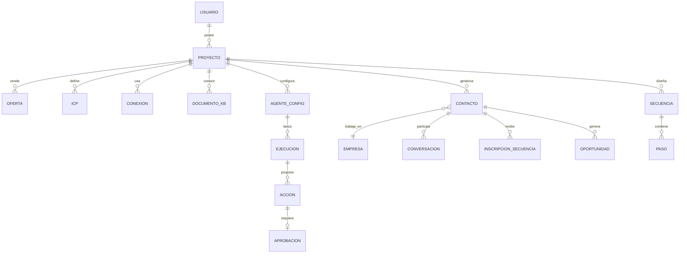
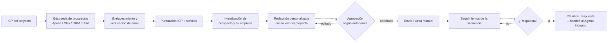
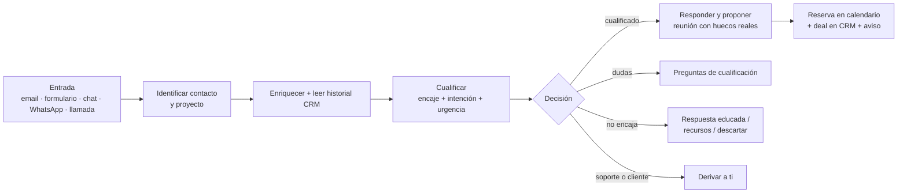
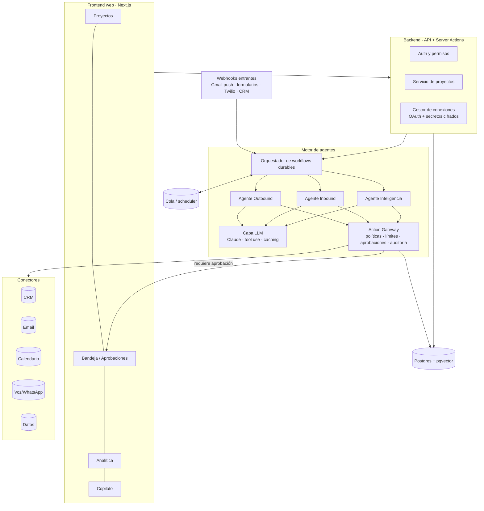

# SalesMate — Plan de producto y técnico

> Plataforma web multiproyecto con agentes de IA que ejecutan acciones de venta
> (outbound e inbound) sobre las herramientas que cada proyecto ya utiliza:
> CRM, correo, calendario, teléfono, WhatsApp, etc.
>
> Inspiración: [Alta](https://www.altahq.com/) (agentes *Katie* outbound,
> *Alex* inbound y *Luna* inteligencia/crecimiento).

---

## Índice

1. [Objetivo y principios](#1-objetivo-y-principios)
2. [Qué tomamos de Alta y qué adaptamos](#2-qué-tomamos-de-alta-y-qué-adaptamos)
3. [Modelo de dominio](#3-modelo-de-dominio)
4. [Módulos funcionales](#4-módulos-funcionales)
5. [Los agentes en detalle](#5-los-agentes-en-detalle)
6. [Autonomía, aprobaciones y guardarraíles](#6-autonomía-aprobaciones-y-guardarraíles)
7. [Integraciones (conectores)](#7-integraciones-conectores)
8. [Arquitectura técnica](#8-arquitectura-técnica)
9. [Modelo de datos inicial](#9-modelo-de-datos-inicial)
10. [Legal, cumplimiento y entregabilidad](#10-legal-cumplimiento-y-entregabilidad)
11. [Roadmap por fases](#11-roadmap-por-fases)
12. [Métricas](#12-métricas)
13. [Costes orientativos](#13-costes-orientativos)
14. [Riesgos y mitigaciones](#14-riesgos-y-mitigaciones)
15. [Decisiones abiertas](#15-decisiones-abiertas)
16. [Próximos pasos inmediatos](#16-próximos-pasos-inmediatos)

---

## 1. Objetivo y principios

**Objetivo:** que una sola persona (tú) pueda vender en paralelo en varios
proyectos —empresas propias y actividad como autónomo— delegando en agentes de
IA el trabajo repetitivo de prospección, seguimiento, cualificación y
agendado, manteniendo el control sobre lo que sale en tu nombre.

**Principios de diseño**

| Principio | Qué implica |
|---|---|
| **Proyecto como unidad de aislamiento** | Cada proyecto tiene su oferta, su ICP, su voz, sus conexiones, sus contactos y sus límites. Un agente nunca mezcla datos ni identidades entre proyectos. |
| **Humano en el bucle por defecto** | Todo empieza en modo "borrador + aprobación". La autonomía se concede por proyecto, por agente y por tipo de acción, y se gana con datos. |
| **Herramientas existentes como fuente de verdad** | El CRM del proyecto sigue siendo el sistema de registro. SalesMate orquesta y registra; no obliga a migrar. |
| **Todo es auditable** | Cada acción de un agente queda registrada con su razonamiento, datos usados, quién la aprobó y su resultado. |
| **Cumplimiento desde el diseño** | RGPD, LSSI, normativa de llamadas y la Ley de IA europea se aplican en el motor de acciones, no "a mano". |
| **Construir lo diferencial, integrar lo demás** | No reconstruir un CRM, un dialer ni una base de datos de contactos: conectarse a ellos. |

---

## 2. Qué tomamos de Alta y qué adaptamos

| Alta | SalesMate | Adaptación |
|---|---|---|
| **Katie** – AI outbound: busca prospectos en 50+ fuentes, detecta señales y lanza outreach multicanal personalizado | **Agente Outbound** | Igual concepto, pero por proyecto y empezando por email + tareas manuales de LinkedIn/llamada. |
| **Alex** – AI inbound: cualifica leads por llamada/chat con contexto del CRM, puntúa intención y enruta | **Agente Inbound** | Empezamos por email entrante y formularios web; chat, WhatsApp y voz después. "Enrutar" = notificarte a ti o agendar directamente. |
| **Luna** – AI growth: señales de compra, lookalikes, cuentas de alta intención, mejora continua de los otros agentes | **Agente de Inteligencia** (fase posterior) | Investigación de cuentas, señales, aprendizaje de qué mensajes funcionan por proyecto. |
| — | **Copiloto** (chat transversal) | Preguntas tipo "¿qué tengo pendiente hoy en el proyecto X?", "prepárame la llamada con Y". |

Diferencia clave respecto a Alta: Alta está pensada para un equipo comercial de
una empresa; SalesMate está pensada para **una persona con varios negocios**.
Eso obliga a resolver bien el aislamiento entre proyectos, la identidad de
envío (qué buzón/dominio/número usa cada proyecto) y una bandeja unificada de
aprobaciones.

---

## 3. Modelo de dominio



**Conceptos**

- **Proyecto**: una empresa, marca o tu actividad de autónomo. Contiene:
  - *Perfil*: nombre, web, sector, idioma(s), zona horaria, firma.
  - *Oferta*: productos/servicios, precios o rangos, casos de éxito, objeciones típicas y respuestas.
  - *ICP y buyer personas*: sector, tamaño, geografía, cargos, dolores, señales de compra, exclusiones.
  - *Voz de marca*: tono, tuteo/usted, longitud de mensajes, ejemplos de correos buenos.
  - *Base de conocimiento*: PDFs, web, FAQs, propuestas antiguas (indexadas para RAG).
  - *Conexiones*: CRM, buzones, calendario, teléfono, WhatsApp, fuentes de datos.
  - *Reglas*: límites diarios, horario de envío, listas de exclusión, nivel de autonomía.
- **Contacto / Empresa**: espejo local (caché) de lo que hay en el CRM del proyecto más el enriquecimiento. Con `crm_external_id` para sincronizar.
- **Conversación**: hilo multicanal (email, WhatsApp, llamada, chat) con un contacto.
- **Secuencia**: cadencia outbound (pasos, canal, espera, condiciones de salida).
- **Ejecución de agente**: una "corrida" del agente sobre un objetivo (p. ej. "procesar lead entrante #123").
- **Acción**: cualquier efecto externo (enviar email, crear deal, agendar reunión, llamar). Siempre pasa por el *Action Gateway* (ver §8).
- **Aprobación**: decisión humana sobre una acción (aprobar, editar y aprobar, rechazar con motivo — el motivo realimenta al agente).

**Regla de oro de multiproyecto:** un mismo contacto puede existir en varios
proyectos, pero el sistema detecta el solapamiento y aplica una política
global ("no contactar a la misma persona desde dos proyectos en < N días" y
listas de exclusión globales, p. ej. tus clientes actuales).

---

## 4. Módulos funcionales

### 4.1 Gestión de proyectos (onboarding guiado)
- Asistente de alta: URL de la web → la IA propone oferta, ICP y voz de marca a partir de la web y documentos subidos → tú validas.
- Plantillas por tipo de proyecto (servicios profesionales B2B, SaaS, producto físico, consultoría freelance…).
- Duplicar proyecto, archivar, pausar todos los agentes de un proyecto con un clic (*kill switch*).

### 4.2 Conexiones
- Catálogo de conectores por categoría (CRM, email, calendario, teléfono, mensajería, datos).
- OAuth donde exista; API keys cifradas donde no.
- Estado de salud de cada conexión (token caducado, cuota agotada, errores) y alertas.
- Mapeo de campos y etapas del CRM (p. ej. "Lead cualificado" en SalesMate ↔ etapa X del pipeline de Pipedrive).

### 4.3 Bandeja unificada (el corazón del día a día)
- **Cola de aprobaciones** de todos los proyectos: borradores de email, respuestas, cambios en CRM, reuniones propuestas. Aprobar / editar / rechazar en lote, también desde el móvil.
- **Conversaciones**: respuestas entrantes clasificadas (interesado, objeción, no ahora, baja, fuera de oficina, rebote…).
- **Tareas manuales** generadas por los agentes (p. ej. "envía esta nota de conexión en LinkedIn", "llama a X, guion adjunto").

### 4.4 Base de conocimiento por proyecto
- Ingesta de documentos, URLs y notas; indexado vectorial.
- Los agentes **solo** pueden afirmar hechos sobre la oferta que estén respaldados aquí (anti-alucinación).

### 4.5 Contactos, listas y segmentos
- Importar desde CRM, CSV o proveedores de datos.
- Enriquecimiento (email, cargo, empresa, tecnologías, señales).
- Puntuación de encaje con el ICP y de intención.

### 4.6 Secuencias (outbound)
- Editor de cadencias multicanal con condiciones (si responde → salir; si abre/visita web → acelerar; si rebota → buscar otro email).
- Personalización por contacto generada por IA, con variables y "hooks" de investigación.

### 4.7 Analítica
- Por proyecto y global: actividad, tasas de respuesta, reuniones, oportunidades, ingresos atribuidos, coste de IA por reunión.
- Calidad del agente: % de borradores aprobados sin editar, motivos de rechazo.

### 4.8 Copiloto
- Chat con contexto de todos tus proyectos: resumen diario, preparación de llamadas, búsqueda en conversaciones, "¿qué deals están parados?".

---

## 5. Los agentes en detalle

Todos los agentes comparten la misma infraestructura: reciben un **objetivo**,
cargan el **contexto del proyecto** (oferta, ICP, voz, KB, reglas), usan
**herramientas** (capacidades de los conectores) y producen **acciones** que
pasan por el gateway de aprobación.

### 5.1 Agente Outbound



**Responsabilidades**
1. Construir listas a partir del ICP (o recibirlas).
2. Deduplicar contra CRM, otros proyectos y listas de exclusión.
3. Investigar: web de la empresa, noticias, ofertas de empleo, LinkedIn (vía proveedor), tecnologías.
4. Escribir el primer mensaje y los seguimientos, citando internamente qué dato justifica cada personalización.
5. Gestionar la cadencia: horarios, límites por buzón, días festivos por país.
6. Detectar respuestas y traspasarlas al Agente Inbound (o a ti).
7. Registrar todo en el CRM del proyecto.

**Señales que puede usar** (por fases): visita a la web (pixel/reverse-IP), nueva ronda de financiación, contratación de un perfil relevante, cambio de puesto del contacto, interacción con tus publicaciones, cliente perdido hace X meses (reactivación).

### 5.2 Agente Inbound



**Responsabilidades**
1. Escuchar los canales de entrada de cada proyecto (y saber a qué proyecto pertenece cada mensaje: por buzón, formulario, número o dominio).
2. Responder en minutos (velocidad = conversión), dentro del horario y tono definidos.
3. Cualificar con un marco configurable (BANT, MEDDIC simplificado o preguntas propias del proyecto).
4. Agendar usando disponibilidad real del calendario y tipos de reunión del proyecto.
5. Crear/actualizar contacto, empresa y oportunidad en el CRM; adjuntar resumen.
6. Preparar un *brief* previo a la reunión.
7. También procesa las **respuestas a outbound** (son "inbound" a efectos de conversación).

### 5.3 Agente de Inteligencia (fase 4)
- Investigación profunda de cuentas bajo demanda.
- Vigilancia de señales y generación de "cuentas calientes" para el outbound.
- Lookalikes a partir de tus mejores clientes de cada proyecto.
- Análisis de qué asuntos, ángulos y canales funcionan → propone cambios en secuencias (que tú apruebas).

### 5.4 Post-venta (opcional, futuro)
- Recordatorios de seguimiento tras propuesta, renovaciones, petición de referencias.
- Paso a facturación: al ganar un deal, crear el cliente y el borrador de factura en tu ERP (p. ej. Founderp).

---

## 6. Autonomía, aprobaciones y guardarraíles

### 6.1 Niveles de autonomía (por proyecto × agente × tipo de acción)

| Nivel | Nombre | Comportamiento |
|---|---|---|
| 0 | **Sugerir** | El agente solo propone ideas/tareas; tú ejecutas. |
| 1 | **Borrador** | El agente prepara la acción completa; nada sale sin tu aprobación. *(por defecto)* |
| 2 | **Autónomo con límites** | Ejecuta solo acciones de bajo riesgo dentro de reglas (p. ej. seguimientos de una secuencia ya aprobada, respuestas a FAQ, agendar) y pide aprobación para el resto. |
| 3 | **Autónomo** | Ejecuta todo dentro de los límites globales; tú revisas a posteriori. |

Ejemplo de configuración razonable tras unas semanas: *primer email outbound*
= nivel 1, *seguimientos* = nivel 2, *respuesta inbound con propuesta de
reunión* = nivel 2, *cambiar precio u ofrecer descuento* = nunca automático.

### 6.2 Guardarraíles obligatorios (aplicados en el Action Gateway)
- Límites diarios por buzón/número/proyecto y ventanas horarias por zona del destinatario.
- Listas de exclusión: global, por proyecto, bajas, clientes, competidores, Lista Robinson (llamadas).
- Deduplicación entre proyectos y "periodo de enfriamiento" por contacto.
- Detección de respuestas que obligan a parar: "no me interesa", "baja", "no me escribas", amenazas, temas legales → parar y avisar.
- Validación de contenido: sin compromisos de precio/plazo no autorizados, sin afirmaciones no respaldadas por la KB, sin datos personales sensibles.
- Presupuesto de IA y de créditos de datos por proyecto.
- *Kill switch* global y por proyecto.

### 6.3 Aprendizaje a partir de tus correcciones
- Cada edición o rechazo se guarda con su motivo.
- Se usan como ejemplos (*few-shot*) en la voz del proyecto y para evaluar versiones nuevas de prompts.

---

## 7. Integraciones (conectores)

### 7.1 Diseño: capacidades, no proveedores
Los agentes no llaman a "HubSpot" o "Gmail", sino a **capacidades**:

```
crm.find_contact      crm.upsert_contact     crm.upsert_deal      crm.log_activity
email.list_threads    email.send             email.create_draft   email.watch_inbox
calendar.free_slots   calendar.book          calendar.watch
phone.call            phone.sms              messaging.send       messaging.watch
data.search_people    data.enrich_person     data.enrich_company  data.verify_email
web.research          kb.search
```

Cada conector implementa un subconjunto. Así un proyecto puede usar Pipedrive y
otro Twenty o HubSpot, sin que cambie el agente. Se puede aprovechar el
ecosistema **MCP** (Model Context Protocol): muchos proveedores ya publican
servidores MCP que pueden envolverse como adaptadores, aunque para acciones de
escritura conviene una capa propia con validación y auditoría.

### 7.2 Catálogo priorizado

| Categoría | Fase 1 | Fase 2-3 | Notas |
|---|---|---|---|
| **CRM** | HubSpot, Pipedrive, Twenty | Salesforce, Zoho, Notion/Airtable como "CRM ligero" | Proyecto sin CRM → CRM interno mínimo de SalesMate. |
| **Email** | Gmail / Google Workspace, Microsoft 365 (Graph) | IMAP/SMTP genérico | Enviar desde tu buzón real (mejor entregabilidad y respuestas en tu bandeja). |
| **Calendario** | Google Calendar, Outlook | Cal.com / Calendly | Huecos reales + enlaces de reserva. |
| **Formularios web** | Webhook genérico + snippet propio | Typeform, Tally, formularios de WordPress | Entrada principal de inbound. |
| **Datos/enriquecimiento** | Apollo o Clay | Lusha, Hunter, ZoomInfo, Crunchbase | Pago por uso; presupuestar por proyecto. |
| **Verificación de email** | NeverBounce / ZeroBounce / MillionVerifier | — | Antes de cualquier envío outbound. |
| **WhatsApp** | — | WhatsApp Business Cloud API (Meta) | Requiere opt-in y plantillas aprobadas para iniciar conversación. |
| **Teléfono / voz** | — | Twilio + plataforma de voz IA (Vapi, Retell, ElevenLabs) | Grabación, transcripción, resumen; agente de voz solo inbound o con consentimiento. |
| **LinkedIn** | Tareas manuales asistidas | Proveedor tipo Unipile/HeyReach (riesgo) | LinkedIn no ofrece API de mensajería y prohíbe la automatización: riesgo de bloqueo de cuenta. |
| **Grabación de reuniones** | — | Fireflies, Otter, Gong, Google Meet | Resúmenes y próximos pasos al CRM. |
| **Notificaciones** | Email + push web | Slack, Telegram | Avisos de leads calientes y aprobaciones pendientes. |
| **ERP/facturación** | — | Founderp, Holded | Cierre → cliente + factura en borrador. |

---

## 8. Arquitectura técnica

### 8.1 Vista general



### 8.2 Stack recomendado

Pensado para un desarrollador solo/equipo pequeño, rápido de iterar y barato al principio.

| Capa | Elección | Por qué / alternativas |
|---|---|---|
| Lenguaje | **TypeScript** en todo el stack | Un solo lenguaje para UI, API y agentes. |
| Frontend + API | **Next.js** (App Router) + Tailwind + shadcn/ui | Alternativa: Remix/React Router. |
| Base de datos | **Postgres** (Supabase o Neon) + **pgvector** | Relacional + vectores en el mismo sitio. Supabase añade Auth y Storage. |
| ORM | Drizzle | Alternativa: Prisma. |
| Auth | Supabase Auth o Clerk | Preparado para multiusuario aunque empieces solo. |
| Workflows durables / colas | **Inngest** o **Trigger.dev** | Reintentos, esperas de días ("enviar seguimiento en 3 días"), pasos con estado, ejecución tras aprobación. Alternativa más pesada: Temporal. |
| LLM | **Claude** (API de Anthropic) con *tool use*, salidas estructuradas y *prompt caching* | Modelo grande para investigación/redacción, modelo rápido y barato para clasificación y triaje. Abstraer el proveedor para poder cambiar. |
| Agentes | Bucle de agente propio sobre la API (o Claude Agent SDK) + herramientas = capacidades de conectores | Mantener el control del gateway de acciones. |
| Integraciones | Adaptadores propios; valorar **Nango** o **Composio** para OAuth y sincronización de muchas APIs | Ahorra meses de OAuth/refresh tokens. |
| Secretos | Cifrado a nivel de columna (pgsodium/KMS) | Tokens OAuth nunca en claro. |
| Ficheros | Supabase Storage / S3 | Documentos de la KB, grabaciones. |
| Hosting | **Vercel** (web) + workers del proveedor de workflows | Alternativa: Railway/Fly.io si hay procesos largos. |
| Observabilidad | Sentry (errores) + Langfuse o similar (trazas de LLM y evaluaciones) | Imprescindible para depurar agentes. |
| Email transaccional propio | Resend / Postmark | Notificaciones de la app, no outbound. |

### 8.3 Action Gateway (pieza crítica)

Toda acción con efecto externo sigue este ciclo:

```
propuesta del agente
  → validación de esquema
  → políticas (límites, horario, exclusiones, dedupe, contenido)
  → ¿nivel de autonomía permite ejecutar? ── no ──→ cola de aprobación → (aprobada/editada)
  → ejecución idempotente en el conector
  → registro en auditoría + CRM
  → evento de resultado (enviado, rebotado, respondido…)
```

Requisitos: idempotencia (clave por acción, nunca enviar dos veces), reintentos
con backoff, registro inmutable, y posibilidad de "deshacer" lo deshacible
(borrar borrador, cancelar reunión, revertir cambio de CRM).

### 8.4 Contexto y memoria de los agentes
- **Contexto de proyecto** (estable, cacheado): oferta, ICP, voz, reglas, ejemplos aprobados.
- **Contexto de contacto** (dinámico): ficha, historial de conversación, actividades del CRM, investigación previa.
- **Recuperación** (RAG) de la KB para responder preguntas sobre el producto.
- **Memoria de aprendizaje**: correcciones y resultados (qué obtuvo respuesta).

### 8.5 Evaluación de calidad
- Conjunto de casos de prueba por agente (emails entrantes reales anonimizados, prospectos de ejemplo) con criterios: tono, exactitud, cumplimiento, llamada a la acción.
- Evaluación automática (LLM como juez + reglas) antes de cambiar prompts o modelos.
- Métrica norte de calidad: **% de acciones aprobadas sin edición**.

---

## 9. Modelo de datos inicial

Tablas principales (todas con `project_id` salvo las globales, y con
*row-level security* para aislar proyectos):

```
users                (id, email, name, timezone)
projects             (id, owner_id, name, type, website, languages, timezone, status, settings jsonb)
project_offers       (id, project_id, name, description, pricing, proof_points jsonb)
project_icps         (id, project_id, name, firmographics jsonb, personas jsonb, signals jsonb, exclusions jsonb)
project_voice        (id, project_id, guidelines, examples jsonb)
kb_documents         (id, project_id, source, title, status)
kb_chunks            (id, document_id, content, embedding vector)
connections          (id, project_id, provider, category, capabilities text[], credentials_encrypted, status, last_error)
field_mappings       (id, connection_id, local_field, remote_field)

companies            (id, project_id, crm_external_id, domain, name, data jsonb)
contacts             (id, project_id, company_id, crm_external_id, email, phone, linkedin_url, data jsonb,
                      icp_score, intent_score, status, do_not_contact bool)
global_suppressions  (id, owner_id, type [email|domain|phone], value, reason)

conversations        (id, project_id, contact_id, channel, external_thread_id, status, classification)
messages             (id, conversation_id, direction, channel, body, sent_at, metadata jsonb)

sequences            (id, project_id, name, status, settings jsonb)
sequence_steps       (id, sequence_id, order, channel, delay, template, conditions jsonb)
enrollments          (id, sequence_id, contact_id, current_step, status, next_run_at)

agent_configs        (id, project_id, agent_type, autonomy jsonb, limits jsonb, prompt_version)
agent_runs           (id, agent_config_id, trigger, goal, status, trace_id, cost_usd, started_at, ended_at)
actions              (id, run_id, project_id, type, payload jsonb, status, idempotency_key, executed_at, result jsonb)
approvals            (id, action_id, decision, edited_payload jsonb, reason, decided_by, decided_at)
audit_log            (id, project_id, actor [agent|user|system], event, data jsonb, created_at)

opportunities        (id, project_id, contact_id, crm_external_id, stage, amount, close_date)
meetings             (id, project_id, contact_id, calendar_event_id, starts_at, brief)
```

---

## 10. Legal, cumplimiento y entregabilidad

> ⚠️ Orientativo, no es asesoramiento jurídico. Conviene validar el
> planteamiento con un abogado especializado en protección de datos antes de
> activar outbound automatizado, sobre todo si tus proyectos operan en España/UE.

### 10.1 Marco que afecta directamente al producto (España/UE)
- **RGPD / LOPDGDD**: base jurídica para tratar datos de prospectos (habitualmente *interés legítimo* en B2B, documentando la ponderación), deber de informar cuando los datos no se obtienen del interesado (art. 14: en la primera comunicación), derechos de acceso/supresión/oposición, registro de actividades, contratos de encargo con proveedores (DPA) y transferencias internacionales.
- **LSSI-CE (art. 21)**: restringe las comunicaciones comerciales por email no solicitadas sin consentimiento previo o relación contractual previa. La aplicación al email B2B en frío es un punto delicado en España → hay que definir una política clara (p. ej. priorizar direcciones genéricas corporativas, contenido no meramente publicitario, baja en un clic, o canales alternativos) y que el sistema la aplique por proyecto y país.
- **Llamadas comerciales (Ley 11/2022 General de Telecomunicaciones)**: desde 2023, las llamadas comerciales no solicitadas a personas físicas requieren consentimiento previo u otra base legitimadora; consultar **Lista Robinson**. → El agente de voz se plantea solo para inbound o contactos con consentimiento.
- **Ley de IA europea (AI Act, art. 50)**: obligación de informar a las personas de que interactúan con un sistema de IA (chat y voz), salvo que sea evidente. → Avisos configurables en chat/voz; en email, política explícita de transparencia.
- **WhatsApp**: políticas de Meta exigen opt-in; iniciar conversaciones solo con plantillas aprobadas.
- **LinkedIn**: sus condiciones prohíben la automatización; riesgo de restricción de cuenta.

### 10.2 Implementación en el producto
- Campo de **base jurídica y origen del dato** en cada contacto.
- Pie legal y enlace de **baja en un clic** por proyecto; las bajas se propagan a todos los proyectos si así se configura.
- Exportación y borrado de datos de un contacto (derechos ARSOPOL).
- Retención configurable y purgado automático de prospectos que no responden.
- Registro de consentimientos (formularios, WhatsApp, llamadas).

### 10.3 Entregabilidad de email
- **Dominios secundarios** para outbound por proyecto (p. ej. `getmarca.com`) para proteger el dominio principal.
- SPF, DKIM y DMARC configurados; comprobación automática al conectar un buzón.
- **Calentamiento** progresivo y límites conservadores (orientativo: 30–50 emails/día por buzón al principio).
- Cumplir requisitos de Google/Yahoo para remitentes masivos: baja en un clic, tasa de spam < 0,3 %.
- Verificación de emails antes de enviar; parar si la tasa de rebote supera un umbral.
- Texto plano, sin tracking agresivo, mensajes cortos y realmente personalizados.

---

## 11. Roadmap por fases

Las estimaciones asumen 1 desarrollador a tiempo parcial-completo apoyado por IA;
ajústalas a tu disponibilidad.

### Fase 0 — Fundamentos (2–3 semanas)
- Repo, CI, entornos, auth, base de datos con RLS.
- CRUD de proyectos con onboarding asistido (oferta, ICP, voz).
- Base de conocimiento (subida + indexado + búsqueda).
- Gestor de conexiones con **Gmail/Google Calendar** y **un CRM** (el que más uses).
- Action Gateway + auditoría + cola de aprobaciones (aunque aún no haya agentes).
- **Hito:** creas tus proyectos reales y conectas sus herramientas.

### Fase 1 — Agente Inbound sobre email y formularios (3–4 semanas) · *primer valor real*
- Escucha de buzones (Gmail push) y webhook de formularios por proyecto.
- Clasificación del mensaje, identificación del proyecto, enriquecimiento básico.
- Cualificación y borrador de respuesta con huecos reales de calendario.
- Creación/actualización de contacto y deal en el CRM.
- Bandeja de aprobaciones usable desde móvil + notificaciones.
- **Hito:** ningún lead entrante espera más de X minutos a tener respuesta preparada.

> Por qué empezar por inbound: riesgo legal y reputacional bajo, valor inmediato
> (velocidad de respuesta) y sirve para afinar voz, KB y gateway antes del outbound.

### Fase 2 — Agente Outbound semiautomático por email (4–6 semanas)
- Importación/búsqueda de prospectos (CSV, CRM, Apollo o Clay), dedupe y exclusiones.
- Verificación de email, puntuación ICP, investigación por prospecto.
- Secuencias con primer email aprobado a mano y seguimientos a nivel 2.
- Detección y clasificación de respuestas → handoff al Inbound.
- Comprobaciones de dominio (SPF/DKIM/DMARC), límites y calentamiento.
- Analítica básica por proyecto.
- **Hito:** cada proyecto con una campaña viva generando reuniones.

### Fase 3 — Multicanal (4–6 semanas)
- Tareas de LinkedIn asistidas (y valorar proveedor de automatización con aviso de riesgo).
- WhatsApp Business (inbound y seguimientos con opt-in).
- Chat web embebible por proyecto (inbound 24/7).
- Llamadas: click-to-call, grabación y resumen; agente de voz para inbound.
- Grabadores de reuniones → resumen y próximos pasos al CRM.

### Fase 4 — Inteligencia y autonomía (continuo)
- Agente de Inteligencia: señales, cuentas calientes, lookalikes.
- Optimización de secuencias basada en resultados (A/B de asuntos y ángulos).
- Subida gradual de niveles de autonomía donde la tasa de aprobación sin edición sea alta.
- Copiloto con resumen diario multiproyecto.
- Post-venta y conexión con ERP/facturación.

### Fase 5 — (Opcional) Producto para terceros
- Multiusuario/equipos, roles, facturación por suscripción, onboarding autoservicio.
- Solo si decides comercializar SalesMate; condiciona decisiones de seguridad y multi-tenant desde la Fase 0 (por eso RLS desde el principio).

---

## 12. Métricas

| Tipo | Métrica |
|---|---|
| **Negocio** (por proyecto) | Reuniones agendadas/semana, oportunidades creadas, ingresos cerrados atribuidos, coste por reunión. |
| **Inbound** | Tiempo hasta primera respuesta, % leads cualificados, % leads que agendan. |
| **Outbound** | Tasa de respuesta, tasa de respuesta positiva, rebote, bajas, quejas de spam. |
| **Calidad del agente** | % aprobado sin edición, % rechazado (y motivos), errores de acción, alucinaciones detectadas. |
| **Operación** | Coste de LLM y datos por proyecto, salud de conexiones, tiempo que dedicas a aprobar al día. |

---

## 13. Costes orientativos

Órdenes de magnitud mensuales para uso personal con varios proyectos;
verificar precios actuales de cada proveedor.

| Partida | Rango aproximado |
|---|---|
| Hosting web + BD + workflows (planes iniciales) | 0–75 € |
| LLM (Claude), depende del volumen; usar modelo pequeño para triaje y caching del contexto | 20–200 € |
| Datos/enriquecimiento (Apollo/Clay/etc.) | 50–300 € |
| Verificación de email | 10–50 € |
| Dominios y buzones secundarios para outbound | 10–20 € por buzón |
| Twilio/voz/WhatsApp (fase 3) | por uso |
| Observabilidad (Sentry, Langfuse) | 0–50 € en planes iniciales |

---

## 14. Riesgos y mitigaciones

| Riesgo | Mitigación |
|---|---|
| El agente envía algo incorrecto en tu nombre | Nivel 1 por defecto, validación de contenido, KB como única fuente de hechos, kill switch, auditoría. |
| Mezcla de datos o identidad entre proyectos | `project_id` + RLS en todas las tablas, contexto de agente cargado por proyecto, tests específicos de aislamiento. |
| Daño a la reputación de dominio | Dominios secundarios, calentamiento, límites, verificación, parada automática por rebotes/quejas. |
| Incumplimiento normativo | Políticas por canal y país en el gateway, base jurídica por contacto, baja en un clic, revisión legal previa al outbound. |
| Bloqueo de cuenta LinkedIn | Tareas manuales asistidas por defecto; automatización solo como opción consciente. |
| Dependencia de APIs de terceros / cambios | Capa de capacidades + adaptadores; monitor de salud de conexiones. |
| Coste de IA descontrolado | Presupuesto por proyecto, modelo pequeño para tareas simples, caching, límites por ejecución. |
| Alcance excesivo (querer todo a la vez) | Roadmap por fases; no pasar a la siguiente sin cumplir el hito de la anterior. |

---

## 15. Decisiones abiertas

Necesito tu input para concretar la Fase 0–1:

1. **Proyectos iniciales**: ¿cuáles son (nombre, qué venden, a quién, en qué país/idioma)?
2. **CRM por proyecto**: ¿qué CRM usa cada uno (HubSpot, Pipedrive, Twenty, ninguno…)? ¿Comparten CRM?
3. **Correo y calendario**: ¿Google Workspace, Microsoft 365 u otro? ¿Un buzón por proyecto?
4. **Canales de inbound actuales**: formularios web (¿qué tecnología?), email, WhatsApp, teléfono…
5. **Volumen esperado**: leads entrantes/semana y prospectos outbound/semana por proyecto.
6. **Usuarios**: ¿solo tú, o habrá socios/colaboradores por proyecto?
7. **Comercialización**: ¿herramienta solo personal o posible producto SaaS en el futuro?
8. **Proveedor de datos**: ¿ya tienes cuenta en Apollo, Clay, Lusha…?
9. **Preferencia de stack/hosting**: ¿te encaja Next.js + Supabase/Neon + Vercel, o tienes otra preferencia?
10. **Política de outbound**: ¿a qué países y tipo de destinatario (empresas, autónomos, particulares)? Afecta directamente a qué es legal y por qué canal.

---

## 16. Próximos pasos inmediatos

1. Responder a las decisiones abiertas de §15.
2. Rellenar una ficha por proyecto (oferta, ICP, voz, herramientas) — servirá de semilla del onboarding.
3. Validar con asesoría la política de outbound (§10).
4. Arrancar Fase 0: scaffolding del repo (Next.js + TypeScript + Postgres + Drizzle + Inngest), esquema de datos de §9, auth y CRUD de proyectos.
5. Primera integración: Gmail + Google Calendar + el CRM principal.
